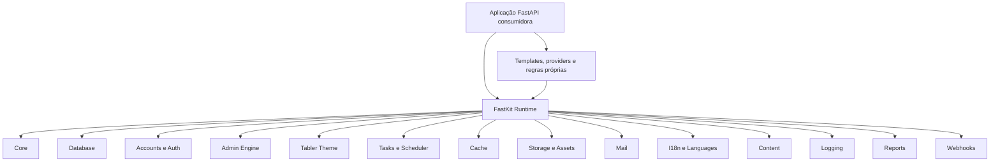
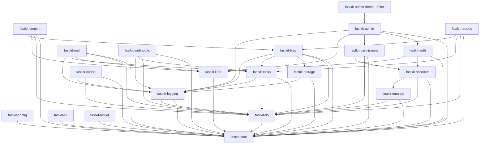
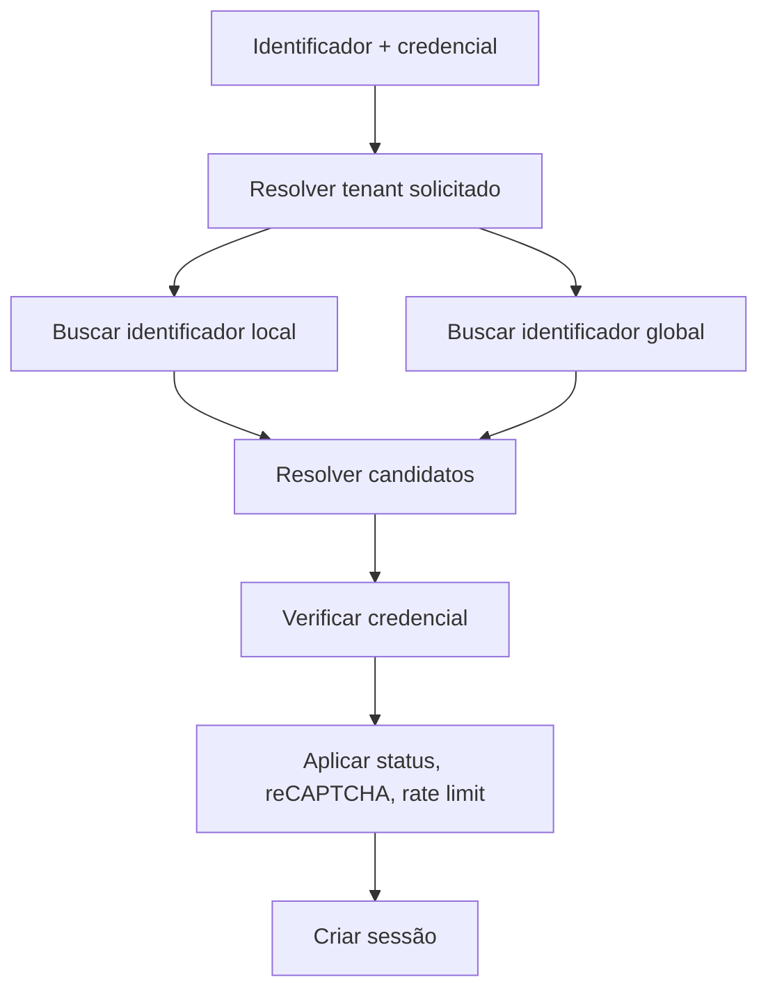
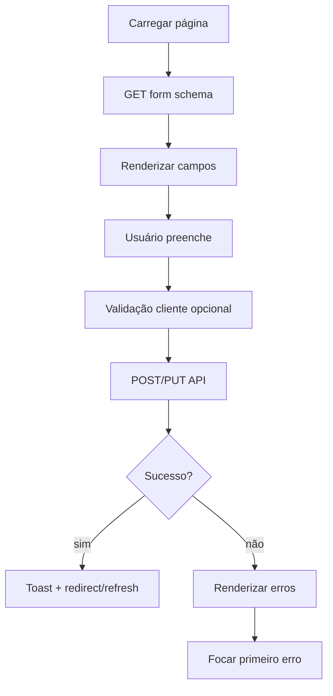
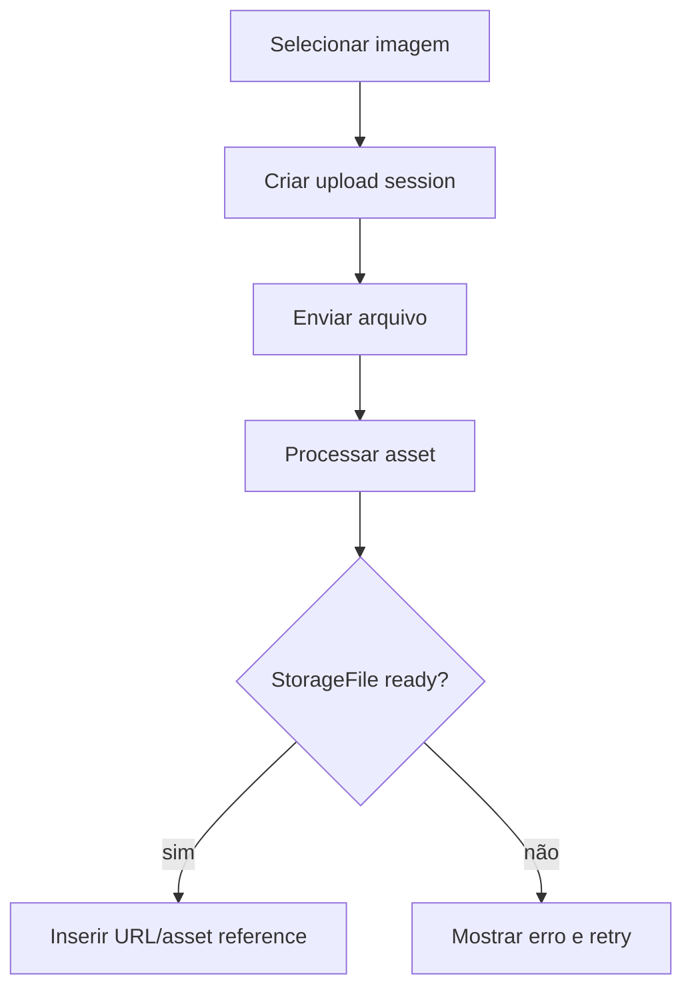
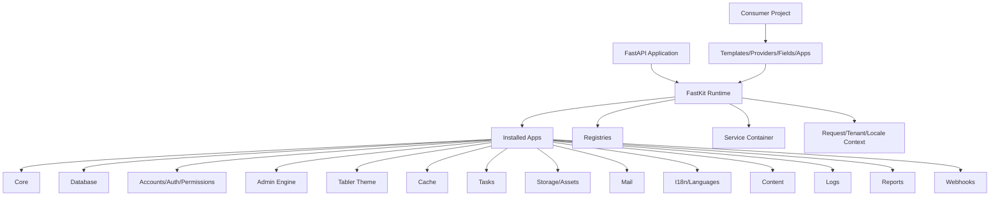

# FastKit

## Ecossistema modular, extensível e assíncrono para aplicações FastAPI

**Documento de arquitetura funcional e técnica**

**Data de referência:** 14 de julho de 2026  
**Nome do ecossistema:** `FastKit`  
**Objetivo:** definir um conjunto reutilizável de packages, módulos, contratos, componentes administrativos, providers e ferramentas para que qualquer aplicação FastAPI possa instalar, configurar, estender e atualizar funcionalidades comuns sem copiar código.

---

## Objetivo deste documento

Este documento deve servir simultaneamente como:

1. especificação funcional;
2. especificação técnica;
3. contrato de implementação para uma IA;
4. guia de organização do monorepo;
5. guia de criação e publicação dos packages;
6. contrato de compatibilidade entre packages;
7. referência para o admin próprio;
8. referência para autenticação, usuários, tenants, permissões e sessões;
9. referência para cache, fila, scheduler, mídia, e-mail, conteúdo, traduções, reports, logs e webhooks;
10. referência para templates extensíveis e substituíveis;
11. referência para testes de sucesso, erro, concorrência e recuperação;
12. referência para build, desenvolvimento, CI, publicação e atualização;
13. base para o `Makefile`;
14. base para projetos que usarão o FastKit sem misturar regras de negócio específicas com o framework.

O FastKit não deve conter regras comerciais do sistema final. Ele deve fornecer infraestrutura genérica, extensível e previsível.

---

## Convenções normativas

Neste documento:

- **DEVE** significa requisito obrigatório;
- **NÃO DEVE** significa proibição;
- **DEVERIA** significa recomendação forte;
- **PODE** significa extensão opcional;
- **package** significa uma distribuição Python publicável separadamente;
- **app** significa um módulo registrável no FastKit;
- **projeto consumidor** significa a aplicação FastAPI que instala o FastKit;
- **tenant local** significa um usuário, registro ou configuração pertencente a um tenant específico;
- **tenant global** significa o escopo de plataforma, representado externamente como `tenant_id = 0`;
- **provider configurado** significa o provider explicitamente selecionado nas configurações;
- **fallback de provider** significa trocar automaticamente para outro provider quando o configurado falhar.

---

# Parte I — Resultado esperado

## 1. Visão geral

O FastKit deverá permitir criar uma aplicação completa assim:

```python
from fastapi import FastAPI
from fastkit import FastKit
from my_app.settings import settings

fastkit = FastKit(settings=settings)

app = FastAPI(
    title=settings.app.name,
    lifespan=fastkit.lifespan,
)

fastkit.install(app)
```

Ou:

```python
from fastkit import create_application
from my_app.settings import settings

app = create_application(settings)
```

O projeto consumidor deverá escolher somente os módulos necessários:

```python
INSTALLED_APPS = [
    "fastkit.core",
    "fastkit.db",
    "fastkit.i18n",
    "fastkit.tenancy",
    "fastkit.accounts",
    "fastkit.auth",
    "fastkit.permissions",
    "fastkit.logging",
    "fastkit.tasks",
    "fastkit.cache",
    "fastkit.storage",
    "fastkit.files",
    "fastkit.mail",
    "fastkit.content",
    "fastkit.admin",
    "fastkit.admin_theme_tabler",
    "my_app.catalog",
    "my_app.billing",
]
```

O ecossistema deverá oferecer:

- instalação seletiva;
- atualização independente;
- migrations por package;
- templates por package;
- traduções por package;
- assets estáticos por package;
- rotas por package;
- models por package;
- tasks por package;
- admin resources por package;
- providers por package;
- system checks por package;
- testes por package;
- documentação por package;
- hooks e registries extensíveis.

---

## 2. Princípio central

O FastKit deve ser um framework de componentes sobre o FastAPI, não uma aplicação monolítica.



O projeto final deve implementar suas regras de negócio em seus próprios módulos, usando os contratos do FastKit.

---

## 3. Requisitos obrigatórios consolidados

A arquitetura considera as seguintes decisões:

- o admin será próprio;
- não será usado Starlette-Admin ou outro admin pronto;
- a interface será baseada no layout vertical oficial do Tabler;
- o frontend administrativo será compilado com Vite;
- o frontend administrativo será escrito em TypeScript;
- o frontend administrativo deverá usar classes reutilizáveis;
- Tailwind será usado de forma isolada para não conflitar com Tabler/Bootstrap;
- o admin será API-first e assíncrono;
- formulários, grids, filtros, buscas, paginação, ações e uploads serão executados por JavaScript chamando APIs;
- todos os estados assíncronos terão feedback visual;
- nenhum clique poderá parecer ignorado;
- todas as respostas da API terão formato único;
- todos os erros da API serão normalizados;
- o formato do Pydantic nunca será exposto diretamente;
- o ORM será SQLAlchemy 2 assíncrono;
- o núcleo será agnóstico de PostgreSQL;
- os bancos suportados serão declarados e validados por matriz de testes;
- cache terá providers de arquivo, banco e Redis;
- apenas o provider configurado será usado;
- não haverá fallback automático de provider;
- falha de cache não deverá derrubar o servidor;
- Redis deverá suportar reconexão, retry controlado e circuit breaker;
- scheduler e fila deverão persistir no banco;
- tasks não poderão ser perdidas com reinício;
- e-mails serão assíncronos;
- e-mail terá providers configuráveis;
- templates de e-mail serão substituíveis pelo projeto;
- um override explícito de template deverá bypassar completamente o template padrão;
- templates administrativos também serão substituíveis;
- o tema Tabler será atualizável independentemente da engine do admin;
- idiomas serão gerenciáveis;
- o banco inicial deverá criar English, Portuguese e Spanish;
- deverá existir suporte a `pt`, `pt_BR`, `pt_PT`, `es`, `es_ES` e variantes configuráveis;
- deverá existir gestor de Languages;
- deverá existir gestor de Content;
- deverá existir campo administrativo de edição de HTML;
- o editor HTML deverá permitir upload e inserção de imagens;
- mídia deverá ser armazenada com dados completos no banco;
- imagens deverão gerar uma lista de variações;
- storage deverá suportar local e S3;
- reports deverão funcionar em tela e PDF;
- deverá existir `SystemLog`;
- deverá existir `AuditLog`;
- logs gerais deverão ser gravados em `logs/app.log`;
- login administrativo deverá suportar Google reCAPTCHA v3;
- usuários poderão autenticar por múltiplas formas;
- um identificador do mesmo tipo e valor só poderá existir uma vez por tenant;
- usuários de tenant global poderão autenticar em qualquer tenant;
- usuários poderão ser staff, root e ter permissões;
- tudo deverá ser extensível por registries e contratos públicos;
- cada package terá seus próprios testes;
- todos os caminhos públicos de sucesso e erro deverão ser testados;
- o Makefile deverá incluir desenvolvimento, testes, build, migrations, workers, i18n e publicação.

---

## 4. O que não pertence ao FastKit

O FastKit NÃO DEVE implementar regras como:

- plano de assinatura específico;
- regras de catálogo;
- produtos de uma empresa;
- preço;
- lógica de venda;
- entitlement comercial;
- regra de comissão;
- regra editorial;
- regra específica de marketplace;
- regra específica de um gateway;
- regra específica do sistema consumidor.

O FastKit pode fornecer contratos genéricos, modelos auxiliares e engines, mas a regra final pertence ao projeto consumidor.

---

# Parte II — Arquitetura do ecossistema

## 5. Estratégia de distribuição

O FastKit será um monorepo contendo múltiplas distributions Python.

```text
fastkit/
├── packages/
│   ├── fastkit/
│   ├── fastkit-core/
│   ├── fastkit-config/
│   ├── fastkit-db/
│   ├── fastkit-i18n/
│   ├── fastkit-tenancy/
│   ├── fastkit-accounts/
│   ├── fastkit-auth/
│   ├── fastkit-permissions/
│   ├── fastkit-logging/
│   ├── fastkit-cache/
│   ├── fastkit-tasks/
│   ├── fastkit-storage/
│   ├── fastkit-files/
│   ├── fastkit-mail/
│   ├── fastkit-content/
│   ├── fastkit-admin/
│   ├── fastkit-admin-theme-tabler/
│   ├── fastkit-reports/
│   ├── fastkit-webhooks/
│   ├── fastkit-cli/
│   └── fastkit-testkit/
│
├── frontend/
│   └── admin/
│
├── examples/
│   ├── minimal/
│   ├── full/
│   ├── custom-theme/
│   ├── custom-email-templates/
│   ├── multi-tenant/
│   └── custom-auth-provider/
│
├── tests/
│   ├── compatibility/
│   ├── integration/
│   ├── e2e/
│   └── package-boundaries/
│
├── docs/
├── scripts/
├── pyproject.toml
├── pnpm-workspace.yaml
├── Makefile
└── README.md
```

---

## 6. Nome das distributions e imports

As distributions publicadas usarão hífen:

```text
fastkit-core
fastkit-db
fastkit-admin
fastkit-admin-theme-tabler
```

Os packages importáveis usarão underscore:

```text
fastkit_core
fastkit_db
fastkit_admin
fastkit_admin_theme_tabler
```

A fachada pública poderá expor imports amigáveis:

```python
from fastkit.admin import AdminSite
from fastkit.mail import MailService
from fastkit.files import StorageFileService
```

A implementação física separada não deverá depender de namespace packages frágeis para localizar recursos.

---

## 7. Meta-package

A distribution `fastkit` será um meta-package.

Instalação completa:

```bash
pip install fastkit
```

Instalação seletiva:

```bash
pip install fastkit-core fastkit-db fastkit-auth
pip install "fastkit-cache[redis]"
pip install "fastkit-storage[s3]"
pip install "fastkit-files[images]"
pip install "fastkit-mail[ses]"
pip install fastkit-admin fastkit-admin-theme-tabler
```

Extras sugeridos:

```toml
[project.optional-dependencies]
admin = [
    "fastkit-admin",
    "fastkit-admin-theme-tabler",
]
redis = [
    "fastkit-cache[redis]",
]
s3 = [
    "fastkit-storage[s3]",
]
images = [
    "fastkit-files[images]",
]
mail = [
    "fastkit-mail",
]
full = [
    "fastkit-admin",
    "fastkit-admin-theme-tabler",
    "fastkit-cache[redis]",
    "fastkit-storage[s3]",
    "fastkit-files[images]",
    "fastkit-mail[all]",
    "fastkit-reports[pdf]",
    "fastkit-webhooks",
]
```

---

## 8. Grafo de dependências



Dependências circulares são proibidas.

---

# Parte III — Sistema de apps e extensibilidade

## 9. `FastKitApp`

Cada módulo deverá registrar uma classe semelhante a um `AppConfig`.

```python
from fastkit_core.apps import FastKitApp, BootstrapContext


class MailApp(FastKitApp):
    name = "fastkit.mail"
    label = "mail"
    version = "1.0.0"

    requires = (
        "fastkit.core",
        "fastkit.db",
        "fastkit.i18n",
        "fastkit.tasks",
    )

    optional_requires = (
        "fastkit.admin",
    )

    def register_settings(self, context: BootstrapContext) -> None:
        ...

    def register_models(self, context: BootstrapContext) -> None:
        ...

    def register_services(self, context: BootstrapContext) -> None:
        ...

    def register_templates(self, context: BootstrapContext) -> None:
        ...

    def register_translations(self, context: BootstrapContext) -> None:
        ...

    def register_tasks(self, context: BootstrapContext) -> None:
        ...

    def register_admin(self, context: BootstrapContext) -> None:
        ...

    def register_routers(self, context: BootstrapContext) -> None:
        ...

    def register_checks(self, context: BootstrapContext) -> None:
        ...

    async def startup(self, context: BootstrapContext) -> None:
        ...

    async def shutdown(self, context: BootstrapContext) -> None:
        ...
```

---

## 10. Descoberta por entry points

Cada distribution deverá declarar um entry point.

```toml
[project.entry-points."fastkit.apps"]
mail = "fastkit_mail.app:MailApp"
```

O projeto consumidor também poderá publicar seus próprios apps:

```toml
[project.entry-points."fastkit.apps"]
catalog = "my_app.catalog.app:CatalogApp"
billing = "my_app.billing.app:BillingApp"
```

A instalação do package apenas o torna descobrível. A ativação será explícita por `INSTALLED_APPS`.

---

## 11. Ordem determinística de bootstrap

O bootstrap seguirá obrigatoriamente esta ordem:

```text
1. carregar configurações base;
2. descobrir entry points;
3. selecionar INSTALLED_APPS;
4. validar nomes e duplicidades;
5. validar dependências;
6. ordenar o grafo;
7. registrar schemas de settings;
8. validar settings finais;
9. registrar models;
10. criar metadata agregada;
11. configurar database;
12. registrar providers;
13. registrar services;
14. registrar templates;
15. registrar assets estáticos;
16. registrar traduções;
17. registrar tasks;
18. registrar admin resources;
19. registrar routers;
20. registrar system checks;
21. executar checks;
22. iniciar services;
23. marcar runtime como ready.
```

Importar um package NÃO DEVE produzir efeitos globais importantes.

---

## 12. Registries obrigatórios

O runtime deverá conter:

```text
AppRegistry
SettingsRegistry
ModelRegistry
MigrationRegistry
ServiceRegistry
ProviderRegistry
RouterRegistry
TemplateRegistry
StaticRegistry
TranslationRegistry
TaskRegistry
AdminRegistry
FieldRegistry
FilterRegistry
WidgetRegistry
ReportRegistry
WebhookRegistry
HealthCheckRegistry
SystemCheckRegistry
EventRegistry
```

Todos deverão:

- detectar nomes duplicados;
- registrar origem do item;
- permitir introspecção;
- suportar prioridade;
- possuir método `freeze()`;
- impedir alterações após o bootstrap, salvo registries explicitamente dinâmicos;
- produzir erro legível;
- expor listagem para a CLI;
- permitir overrides controlados.

---

## 13. Service container

Não serão usados singletons globais mutáveis.

```python
mail_service = request.app.state.fastkit.services.get(MailService)
```

O container deverá suportar:

- `singleton`;
- `scoped`;
- `transient`;
- factory assíncrona;
- shutdown assíncrono;
- override em testes;
- override pelo projeto consumidor;
- validação de dependências;
- detecção de ciclo;
- introspecção.

Exemplo:

```python
services.register_singleton(
    MailService,
    factory=create_mail_service,
)

services.override(
    EmailProvider,
    factory=create_company_email_provider,
)
```

---

## 14. Hooks e eventos internos

Eventos genéricos:

```text
app.starting
app.started
app.stopping
app.stopped
request.started
request.completed
request.failed
user.created
user.authenticated
user.login_failed
asset.uploaded
asset.ready
asset.failed
email.queued
email.sent
email.failed
task.started
task.completed
task.failed
cache.degraded
cache.recovered
```

Handlers deverão ser:

- assíncronos;
- ordenáveis;
- identificáveis;
- testáveis;
- isolados por timeout;
- configuráveis como críticos ou não críticos.

Um handler não crítico não deverá derrubar a operação principal.

---

# Parte IV — Packages detalhados

## 15. `fastkit-core`

Responsabilidades:

- runtime;
- `FastKit`;
- lifecycle;
- apps;
- registries;
- service container;
- request context;
- response envelope;
- exceptions;
- error codes;
- hooks;
- health checks;
- system checks;
- utilitários portáveis;
- contratos fundamentais.

Estrutura:

```text
fastkit_core/
├── app.py
├── runtime.py
├── lifespan.py
├── apps/
├── registries/
├── services/
├── api/
├── errors/
├── context/
├── events/
├── health/
├── checks/
├── typing/
└── tests/
```

O core NÃO DEVE importar SQLAlchemy, Redis, boto3, Pillow ou Tabler.

---

## 16. `fastkit-config`

Responsabilidades:

- settings tipadas;
- merge de ambientes;
- leitura de TOML;
- leitura de environment variables;
- secrets;
- validação;
- valores por ambiente;
- mascaramento;
- exportação segura de settings públicas para frontend.

Ambientes obrigatórios:

```text
dev
stage
prod
test
```

Arquivos:

```text
config/
├── base.toml
├── dev.toml
├── stage.toml
├── prod.toml
└── test.toml
```

Ordem:

```text
base.toml
→ ambiente.toml
→ .env permitido no ambiente
→ environment variables
→ secret provider
```

Somente fontes configuradas serão usadas.

---

## 17. `fastkit-db`

Responsabilidades:

- SQLAlchemy 2;
- `AsyncEngine`;
- `AsyncSession`;
- base declarativa;
- conventions;
- repositories;
- transaction manager;
- Unit of Work;
- migrations;
- adapters por dialect;
- health check;
- capabilities;
- tipos portáveis;
- fixtures de banco.

Estrutura:

```text
fastkit_db/
├── app.py
├── base.py
├── engine.py
├── session.py
├── transaction.py
├── uow.py
├── repository.py
├── metadata.py
├── types.py
├── capabilities.py
├── dialects/
│   ├── generic.py
│   ├── sqlite.py
│   ├── postgresql.py
│   └── mysql.py
├── migrations/
└── tests/
```

---

## 18. `fastkit-i18n`

Responsabilidades:

- gettext;
- Babel;
- locale resolver;
- locale registry;
- ContextVar;
- pluralização;
- integração Jinja;
- tradução de API;
- tradução de validações;
- extração e compilação;
- gestores de idioma;
- seeds básicos.

---

## 19. `fastkit-tenancy`

Responsabilidades:

- `Tenant`;
- contexto de tenant;
- resolução;
- escopo global;
- proteção contra acesso cruzado;
- mixins;
- filtros;
- auditoria de troca de tenant;
- suporte a subdomínio, path e configuração explícita.

---

## 20. `fastkit-accounts`

Responsabilidades:

- `User`;
- `UserProfile`;
- `LoginIdentifier`;
- flags de usuário;
- memberships opcionais;
- preferências;
- idioma;
- timezone;
- lifecycle do usuário;
- resources administrativos.

---

## 21. `fastkit-auth`

Responsabilidades:

- login;
- logout;
- autenticação por senha;
- autenticação por identificadores;
- OAuth/OIDC;
- magic link;
- OTP;
- sessões;
- tokens;
- reset de senha;
- confirmação;
- proteção de brute force;
- reCAPTCHA v3;
- hooks;
- contratos de providers de autenticação.

---

## 22. `fastkit-permissions`

Responsabilidades:

- roles;
- groups;
- permissions;
- atribuição por tenant;
- permissões globais;
- autorização;
- decorators;
- dependencies;
- cache de permissões;
- resources administrativos.

---

## 23. `fastkit-logging`

Responsabilidades:

- configuração do logging;
- `app.log`;
- JSON logging;
- contexto;
- `SystemLog`;
- `AuditLog`;
- sanitização;
- correlação;
- middleware;
- retenção;
- recursos administrativos.

---

## 24. `fastkit-cache`

Responsabilidades:

- contrato de cache;
- file provider;
- database provider;
- Redis provider;
- namespaces;
- serialização;
- TTL;
- limpeza;
- circuit breaker;
- reconexão;
- health;
- admin de cache.

---

## 25. `fastkit-tasks`

Responsabilidades:

- registry de tasks;
- task queue persistente;
- scheduler persistente;
- workers;
- leases;
- heartbeat;
- retry;
- timeout;
- idempotência;
- cron;
- execução manual;
- recursos administrativos.

---

## 26. `fastkit-storage`

Responsabilidades:

- contrato de storage;
- provider local;
- provider S3;
- upload;
- download;
- URLs assinadas;
- verificação;
- paths;
- metadados;
- health.

---

## 27. `fastkit-files`

Responsabilidades:

- `StorageFile`;
- `StorageFileVariant`;
- `StorageFileReference`;
- `UploadSession`;
- arquivos;
- imagens;
- presets;
- thumbnails;
- processamento;
- validação;
- cleanup;
- recursos administrativos;
- field de upload.

---

## 28. `fastkit-mail`

Responsabilidades:

- templates;
- renderização;
- providers;
- fila;
- `EmailDelivery`;
- attachments;
- tradução;
- preview;
- retry;
- recursos administrativos.

---

## 29. `fastkit-content`

Responsabilidades:

- Languages;
- Content;
- ContentTranslation;
- páginas e blocos;
- editor HTML;
- sanitização;
- imagens no editor;
- preview;
- revisão;
- publicação;
- recursos administrativos.

---

## 30. `fastkit-admin`

Responsabilidades:

- engine administrativa;
- API do admin;
- `AdminSite`;
- `AdminResource`;
- grids;
- forms;
- fields;
- filters;
- actions;
- messages;
- navigation;
- dashboard;
- permissões;
- templates abstratos;
- static registry;
- frontend manifest;
- integração com os demais packages.

O package não deverá embutir a identidade visual do Tabler.

---

## 31. `fastkit-admin-theme-tabler`

Responsabilidades:

- templates concretos;
- layout vertical;
- Tabler;
- ícones;
- CSS compilado;
- JS compilado;
- componentes visuais;
- tema claro/escuro;
- assets;
- traduções visuais.

Atualização do tema:

```bash
pip install --upgrade fastkit-admin-theme-tabler
```

Não deverá exigir atualização obrigatória de cache, tasks, mail ou assets.

---

## 32. `fastkit-reports`

Responsabilidades:

- definitions;
- filters;
- executions;
- screen renderer;
- PDF renderer;
- CSV;
- XLSX opcional;
- execução assíncrona;
- assets gerados;
- recursos administrativos.

---

## 33. `fastkit-webhooks`

Responsabilidades:

- endpoints genéricos;
- assinatura;
- raw body;
- idempotência;
- inbox;
- retries;
- attempts;
- processamento em fila;
- adapters;
- recursos administrativos.

---

## 34. `fastkit-cli`

Responsabilidades:

- comandos agregados;
- discovery dos apps;
- migrations;
- i18n;
- assets;
- workers;
- scheduler;
- usuário root;
- checks;
- templates;
- providers;
- publicação de packages.

---

## 35. `fastkit-testkit`

Responsabilidades:

- factories;
- fake providers;
- app factory;
- database fixtures;
- Redis fake controlado;
- storage fake;
- mail fake;
- task runner;
- assert helpers;
- contract test suites;
- clock congelável;
- tenant context;
- login helpers;
- API client;
- admin page objects.

---

# Parte V — Configuração

## 36. Settings principais

```python
class FastKitSettings(BaseSettings):
    app: AppSettings
    database: DatabaseSettings
    tenancy: TenancySettings
    auth: AuthSettings
    permissions: PermissionSettings
    admin: AdminSettings
    cache: CacheSettings
    tasks: TaskSettings
    storage: StorageSettings
    assets: AssetSettings
    mail: MailSettings
    i18n: I18nSettings
    content: ContentSettings
    logging: LoggingSettings
    reports: ReportSettings
    webhooks: WebhookSettings
```

---

## 37. Exemplo `base.toml`

```toml
[app]
name = "My FastKit App"
environment = "dev"
debug = false
timezone = "UTC"
default_locale = "en"
supported_locales = ["en", "pt", "es"]

[database]
url = "sqlite+aiosqlite:///./data/app.db"
pool_pre_ping = true
echo = false

[tenancy]
resolver = "subdomain"
global_tenant_external_id = 0

[auth]
login_identifier_types = ["email", "username", "phone"]
session_cookie_name = "fastkit_session"
password_min_length = 12

[auth.recaptcha]
enabled = false
provider = "google_v3"
action = "admin_login"
minimum_score = 0.5

[admin]
enabled = true
path = "/admin"
api_path = "/admin/api"
theme = "tabler"
page_size = 25
page_size_options = [10, 25, 50, 100]

[cache]
provider = "file"
default_ttl_seconds = 300

[tasks]
provider = "database"
worker_lease_seconds = 60
heartbeat_seconds = 15

[storage]
provider = "local"

[mail]
provider = "smtp"
strict_template_overrides = true

[i18n]
default_locale = "en"
supported_locales = ["en", "pt", "es"]
fallback_mode = "configured_chain"

[logging]
level = "INFO"
file = "logs/app.log"
system_log_enabled = true

[content]
sanitize_html = true
```

---

## 38. Provider sem fallback

Exemplo:

```toml
[cache]
provider = "redis"
```

Se Redis cair:

- o provider continuará sendo Redis;
- o runtime não trocará para file cache;
- leituras poderão se comportar como cache miss;
- escritas poderão ser descartadas com log;
- o health ficará degraded;
- o cliente tentará se reconectar;
- a aplicação principal continuará quando a operação não for crítica.

Exemplo de e-mail:

```toml
[mail]
provider = "ses"
```

Se SES falhar:

- não usar SMTP;
- registrar tentativa;
- manter a entrega como `retrying`;
- tentar novamente no SES;
- marcar `failed` ao atingir o limite.

---

## 39. Configurações públicas do frontend

Somente valores explicitamente permitidos poderão ser expostos:

```json
{
  "environment": "prod",
  "adminApiBaseUrl": "/admin/api",
  "locale": "en",
  "supportedLocales": ["en", "pt", "es"],
  "recaptcha": {
    "enabled": true,
    "siteKey": "PUBLIC_SITE_KEY",
    "action": "admin_login"
  },
  "features": {
    "darkMode": true,
    "contentEditor": true
  }
}
```

Secrets nunca serão enviados ao frontend.

---

# Parte VI — API consistente

## 40. Envelope único

Toda API gerenciada pelo FastKit deverá usar um envelope único.

### Sucesso com objeto

```json
{
  "success": true,
  "message": {
    "code": "users.created",
    "text": "User created successfully."
  },
  "data": {
    "id": "01J..."
  },
  "errors": [],
  "meta": {
    "request_id": "01J...",
    "timestamp": "2026-07-14T05:30:00Z"
  }
}
```

### Sucesso sem mensagem

```json
{
  "success": true,
  "message": null,
  "data": {},
  "errors": [],
  "meta": {
    "request_id": "01J...",
    "timestamp": "2026-07-14T05:30:00Z"
  }
}
```

### Erro

```json
{
  "success": false,
  "message": {
    "code": "validation.failed",
    "text": "The submitted data is invalid."
  },
  "data": null,
  "errors": [
    {
      "field": "email",
      "path": ["email"],
      "code": "validation.email.invalid",
      "message": "Enter a valid email address.",
      "params": {}
    }
  ],
  "meta": {
    "request_id": "01J...",
    "error_id": "ERR-01J...",
    "timestamp": "2026-07-14T05:30:00Z"
  }
}
```

---

## 41. Lista paginada

```json
{
  "success": true,
  "message": null,
  "data": [
    {
      "id": "1",
      "name": "Example"
    }
  ],
  "errors": [],
  "meta": {
    "request_id": "01J...",
    "timestamp": "2026-07-14T05:30:00Z",
    "pagination": {
      "strategy": "offset",
      "page": 1,
      "page_size": 25,
      "total_items": 100,
      "total_pages": 4,
      "has_previous": false,
      "has_next": true
    }
  }
}
```

---

## 42. Cursor pagination

```json
{
  "success": true,
  "message": null,
  "data": [],
  "errors": [],
  "meta": {
    "pagination": {
      "strategy": "cursor",
      "next_cursor": "opaque-token",
      "previous_cursor": null,
      "has_next": true,
      "has_previous": false
    }
  }
}
```

---

## 43. Normalização do Pydantic

`RequestValidationError` será interceptado globalmente.

Mapeamento:

```text
missing                    → validation.required
string_too_short           → validation.string.min_length
string_too_long            → validation.string.max_length
string_pattern_mismatch    → validation.string.pattern
greater_than               → validation.number.greater_than
greater_than_equal         → validation.number.greater_or_equal
less_than                  → validation.number.less_than
less_than_equal            → validation.number.less_or_equal
int_parsing                → validation.integer.invalid
float_parsing              → validation.number.invalid
bool_parsing               → validation.boolean.invalid
date_parsing               → validation.date.invalid
datetime_parsing           → validation.datetime.invalid
uuid_parsing               → validation.uuid.invalid
value_error                → validation.invalid
```

A mensagem original do Pydantic não será enviada diretamente.

---

## 44. Taxonomia de erros

Categorias:

```text
validation.*
authentication.*
authorization.*
tenant.*
resource.*
conflict.*
rate_limit.*
recaptcha.*
database.*
cache.*
task.*
storage.*
asset.*
email.*
content.*
report.*
webhook.*
internal.*
```

Cada erro terá:

- código estável;
- status HTTP;
- chave de tradução;
- campos;
- parâmetros;
- severidade;
- indicação de retry;
- indicação se deve ser logado;
- indicação se pode ser mostrado ao usuário.

---

## 45. HTTP status

```text
200 OK               leitura ou operação idempotente
201 Created          criação
202 Accepted         operação assíncrona
204 No Content       delete sem body, quando não usar envelope
400 Bad Request      request inválido fora de validação de campo
401 Unauthorized     não autenticado
403 Forbidden        autenticado sem permissão
404 Not Found        recurso inexistente ou invisível
409 Conflict         conflito de unicidade ou estado
422 Unprocessable    validação
429 Too Many Requests
500 Internal Server Error
502 Provider Error
503 Service Unavailable
504 Provider Timeout
```

Por consistência do admin, recomenda-se manter envelope mesmo em erros.

---

# Parte VII — Database e portabilidade

## 46. Bancos suportados

A primeira matriz oficial deverá cobrir:

- SQLite;
- PostgreSQL;
- MySQL/MariaDB compatível com SQLAlchemy async.

URLs:

```text
sqlite+aiosqlite:///./data/app.db
postgresql+asyncpg://...
postgresql+psycopg://...
mysql+asyncmy://...
mysql+aiomysql://...
```

O suporte só poderá ser anunciado quando o dialect estiver na CI.

---

## 47. Regras de portabilidade

O núcleo deverá evitar:

- `JSONB` obrigatório;
- `ARRAY`;
- `CITEXT`;
- enum nativo obrigatório;
- trigger obrigatório;
- stored procedure obrigatória;
- RLS obrigatório;
- advisory lock obrigatório;
- `SKIP LOCKED` obrigatório;
- índice parcial obrigatório;
- SQL específico sem adapter.

Tipos comuns:

- string;
- text;
- integer;
- bigint;
- boolean;
- datetime;
- decimal;
- binary;
- JSON portável;
- UUID gerado na aplicação.

---

## 48. `DatabaseCapabilities`

```python
@dataclass(frozen=True)
class DatabaseCapabilities:
    supports_returning: bool
    supports_skip_locked: bool
    supports_native_json: bool
    supports_native_uuid: bool
    supports_partial_indexes: bool
    supports_advisory_locks: bool
    supports_deferrable_constraints: bool
    supports_select_for_update: bool
```

A implementação genérica deverá sempre existir.

---

## 49. Session e transações

Regras:

- uma `AsyncSession` por request;
- session não poderá ser compartilhada entre tasks concorrentes;
- service não fará commit escondido sem contrato;
- endpoints usarão transaction boundary;
- task terá transaction boundary;
- admin action terá transaction boundary;
- erro causará rollback;
- nested transaction somente quando necessário;
- after-commit hooks serão explícitos.

---

## 50. Base model

```python
class BaseModel:
    id: Mapped[UUID]
    created_at: Mapped[datetime]
    updated_at: Mapped[datetime]
```

Mixins:

```text
TimestampMixin
TenantMixin
SoftDeleteMixin
VersionMixin
MetadataMixin
CreatedByMixin
UpdatedByMixin
```

Soft delete será opt-in, não global.

---

## 51. Migrations por package

Cada package terá seu diretório:

```text
fastkit_accounts/migrations/versions/
fastkit_tasks/migrations/versions/
fastkit_files/migrations/versions/
```

A CLI agregará `version_locations`.

Regras:

- revision IDs terão prefixo do package;
- migrations não dependerão implicitamente da ordem de import;
- dependência entre branches será explícita;
- downgrade será implementado quando seguro;
- data migrations serão idempotentes;
- migrations serão testadas do zero;
- upgrades entre versões suportadas serão testados;
- migrations não importarão models de runtime diretamente;
- cada package publicará compatibilidade mínima.

---

# Parte VIII — Tenancy

## 52. Semântica de tenant global

A regra de negócio externa será:

```text
tenant_id = 0 → usuário global da plataforma
tenant_id > 0 → usuário pertencente a tenant específico
```

Para manter portabilidade, a persistência poderá representar o tenant global como `NULL`, mas toda API pública, contexto e interface deverão expor `0`.

```python
GLOBAL_TENANT_ID = 0
```

Conversões:

```text
API 0       → persistência NULL, quando configurado
persistência NULL → API 0
```

Alternativamente, um adapter poderá criar uma linha física reservada, desde que todos os bancos suportados sejam testados.

---

## 53. `Tenant`

Campos:

```text
id
code
name
status
default_locale
timezone
domain
settings
metadata
created_at
updated_at
```

Constraints:

```text
UNIQUE(code)
UNIQUE(domain), quando domain não for nulo
```

Status:

```text
active
suspended
disabled
```

---

## 54. Resolução de tenant

Resolvers registráveis:

```text
SubdomainTenantResolver
HeaderTenantResolver
PathTenantResolver
HostTenantResolver
SessionTenantResolver
ExplicitTenantResolver
```

Ordem configurável:

```python
TENANT_RESOLVERS = [
    "subdomain",
    "session",
]
```

O header só poderá ser usado em APIs confiáveis e deverá ser validado.

---

## 55. Contexto

```python
tenant = current_tenant.get()
```

O contexto terá:

```text
requested_tenant_id
effective_tenant_id
is_global_scope
source
resolved_at
```

Nunca usar variável global simples.

---

## 56. Filtro de tenant

Repositories tenant-aware deverão exigir contexto.

```python
await repository.list(tenant_context=context)
```

A ausência de tenant em uma operação tenant-scoped deverá falhar.

Root/global poderá selecionar um tenant efetivo, mas isso será auditado.

---

# Parte IX — Users, login e autenticação

## 57. `User`

Campos genéricos:

```text
id
tenant_id
username
email
phone
first_name
last_name
display_name
password_hash
is_active
is_staff
is_root
is_verified
preferred_locale
timezone
last_login_at
password_changed_at
failed_login_count
locked_until
metadata
created_at
updated_at
```

Regras:

- `is_root=true` só será permitido em usuário global;
- staff local terá acesso apenas ao tenant efetivo;
- root poderá entrar em qualquer tenant;
- usuário inativo não autentica;
- usuário bloqueado não autentica;
- password hash nunca aparece em schemas de saída.

---

## 58. `LoginIdentifier`

Para suportar múltiplos formatos sem duplicar lógica:

```text
id
user_id
tenant_id
type
value
normalized_value
is_primary
is_verified
verified_at
metadata
created_at
updated_at
```

Tipos iniciais:

```text
username
email
phone
cpf
external
custom
```

Constraint obrigatória:

```text
UNIQUE(tenant_id, type, normalized_value)
```

A semântica de tenant global seguirá a representação configurada.

---

## 59. Normalizadores

Cada tipo terá um normalizador registrável:

```python
class LoginIdentifierNormalizer(Protocol):
    type: str

    def normalize(self, value: str) -> str:
        ...

    def mask(self, value: str) -> str:
        ...

    def validate(self, value: str) -> None:
        ...
```

Exemplos:

- e-mail: trim + lowercase + normalização Unicode;
- username: trim + lowercase quando case-insensitive;
- telefone: E.164;
- CPF: somente dígitos;
- custom: adapter da aplicação.

---

## 60. Login em tenant específico

Fluxo:



Regra:

1. buscar candidato local;
2. buscar candidato global;
3. não revelar qual existe;
4. verificar a credencial de maneira segura;
5. se somente um corresponder, autenticar;
6. se ambos corresponderem, exigir resolução explícita por portal global ou política configurada;
7. o usuário global autenticado receberá tenant efetivo igual ao tenant solicitado;
8. a sessão manterá `identity_tenant_id` e `effective_tenant_id`.

---

## 61. Sessão

Campos:

```text
id
user_id
identity_tenant_id
effective_tenant_id
token_hash
status
ip_address
user_agent
created_at
last_seen_at
expires_at
revoked_at
metadata
```

Cookie:

- `HttpOnly`;
- `Secure` em stage/prod;
- `SameSite=Lax` ou política configurada;
- path do admin;
- nome configurável;
- rotação após login;
- rotação após mudança de permissão;
- proteção CSRF.

---

## 62. Métodos de autenticação extensíveis

Registry:

```text
PasswordAuthBackend
MagicLinkAuthBackend
OtpEmailAuthBackend
OtpSmsAuthBackend
GoogleOAuthBackend
OidcAuthBackend
ApiKeyAuthBackend
CustomAuthBackend
```

Interface:

```python
class AuthenticationBackend(Protocol):
    name: str

    async def begin(self, context: AuthContext) -> AuthChallenge:
        ...

    async def authenticate(
        self,
        context: AuthContext,
        payload: dict,
    ) -> AuthResult:
        ...
```

Somente backends configurados aparecerão no login.

---

## 63. Password auth

Requisitos:

- Argon2id recomendado;
- política configurável;
- rehash transparente;
- contador de falhas;
- lock temporário;
- rate limit por IP, tenant e identificador normalizado;
- resposta genérica;
- evento de auditoria;
- reCAPTCHA conforme política.

---

## 64. Google reCAPTCHA v3 no admin

Configuração:

```toml
[auth.recaptcha]
enabled = true
provider = "google_v3"
site_key = "${RECAPTCHA_SITE_KEY}"
secret_key = "${RECAPTCHA_SECRET_KEY}"
action = "admin_login"
minimum_score = 0.5
allowed_hostnames = ["admin.example.com"]
timeout_seconds = 5
```

Frontend:

1. carregar script somente quando habilitado;
2. executar no momento do submit;
3. usar action configurada;
4. exibir loading enquanto gera token;
5. enviar token imediatamente;
6. não reutilizar token;
7. em falha de rede, informar claramente;
8. não manter o token em localStorage.

Backend deverá validar:

- `success`;
- `score`;
- `action`;
- `hostname`;
- `challenge_ts`;
- token não duplicado;
- timeout;
- policy de score.

Códigos:

```text
recaptcha.missing
recaptcha.invalid
recaptcha.low_score
recaptcha.action_mismatch
recaptcha.hostname_mismatch
recaptcha.expired
recaptcha.provider_unavailable
```

Uma falha de provider não autorizará login por padrão.

---

## 65. Staff e root

Regras:

```text
regular user:
    sem acesso ao admin

staff:
    pode acessar o admin
    depende de permissions
    limitado ao tenant efetivo

root:
    usuário global
    pode selecionar qualquer tenant
    pode executar ações globais
    toda troca de tenant é auditada
```

`is_staff` não substitui permission checks.

`is_root` não deve ser usado como atalho silencioso fora da autorização central.

---

# Parte X — Roles, groups e permissions

## 66. Modelos

```text
Permission
Role
RolePermission
UserRole
Group
GroupMembership
GroupRole
```

`Permission`:

```text
id
code
name
description
scope
metadata
created_at
updated_at
```

Exemplos:

```text
users.view
users.create
users.update
users.delete
users.impersonate
roles.manage
cache.clear
tasks.retry
system_logs.view
content.publish
assets.delete
reports.export
```

---

## 67. Escopos

```text
global
tenant
own
custom
```

A autorização terá:

```python
await authorization.require(
    user=current_user,
    permission="users.update",
    tenant=current_tenant,
    resource=user,
)
```

---

## 68. Cache de permissões

Pode usar o cache configurado, mas:

- a fonte de verdade é o banco;
- a chave inclui user, tenant e permission version;
- mudança de role incrementa version;
- falha de cache consulta o banco;
- permissão negada nunca será convertida em permitida por falha.

---

# Parte XI — Admin engine

## 69. Princípios do admin

O admin será:

- próprio;
- declarativo;
- API-first;
- assíncrono;
- extensível;
- tenant-aware;
- permission-aware;
- internacionalizado;
- acessível;
- responsivo;
- baseado no layout vertical do Tabler;
- atualizável independentemente.

---

## 70. `AdminSite`

```python
admin_site = AdminSite(
    name="main",
    title="Administration",
    path="/admin",
    api_path="/admin/api",
)
```

Responsabilidades:

- registry;
- rotas;
- navegação;
- dashboard;
- tema;
- templates;
- assets;
- autenticação;
- contexto;
- menus;
- permissions.

---

## 71. `AdminResource`

```python
class UserAdmin(AdminResource[User]):
    name = "users"
    label = _("Users")
    icon = "users"

    list_columns = [
        "id",
        "display_name",
        "email",
        "is_active",
        "is_staff",
        "created_at",
    ]

    search_fields = [
        "display_name",
        "email",
        "username",
    ]

    filters = [
        BooleanFilter("is_active"),
        BooleanFilter("is_staff"),
        DateRangeFilter("created_at"),
    ]

    ordering = ["-created_at"]

    permissions = {
        "list": "users.view",
        "detail": "users.view",
        "create": "users.create",
        "update": "users.update",
        "delete": "users.delete",
    }
```

---

## 72. Extensões do resource

Hooks:

```text
get_queryset
get_columns
get_filters
get_search_fields
get_form
get_field
get_actions
get_permissions
before_create
after_create
before_update
after_update
before_delete
after_delete
serialize_row
serialize_detail
validate_form
```

Todos poderão ser async.

---

## 73. Grid

O grid deverá suportar:

- busca;
- debounce;
- filtros;
- filtros avançados;
- paginação;
- cursor opcional;
- ordenação;
- seleção;
- seleção de todos da página;
- seleção de todos do filtro;
- ações em lote;
- colunas configuráveis;
- persistência de preferências;
- exportação;
- refresh;
- estados vazios;
- skeleton;
- erro;
- retry;
- URL sincronizada;
- cancelamento de requests antigos;
- request race protection.

---

## 74. Filtros

Tipos:

```text
TextFilter
ExactFilter
BooleanFilter
NumberFilter
NumberRangeFilter
DateFilter
DateRangeFilter
DateTimeFilter
ChoiceFilter
MultiChoiceFilter
RelationFilter
AutocompleteFilter
NullFilter
CustomFilter
```

Operadores:

```text
eq
neq
contains
not_contains
starts_with
ends_with
gt
gte
lt
lte
between
in
not_in
is_null
is_not_null
```

Somente campos registrados poderão virar SQL.

---

## 75. Paginação

Parâmetros:

```text
page
page_size
cursor
sort
search
filter[field][operator]
filter[field][value]
```

O servidor validará limites máximos.

O admin deverá preservar filtros ao abrir detail e voltar.

---

## 76. Form engine

Tipos de fields:

```text
TextField
TextareaField
PasswordField
EmailField
PhoneField
NumberField
DecimalField
BooleanField
DateField
DateTimeField
SelectField
MultiSelectField
AutocompleteField
RelationField
FileField
ImageField
RichTextField
CodeField
JsonField
HiddenField
ReadonlyField
CustomField
Fieldset
RepeaterField
```

Cada field terá:

```text
name
label
help_text
required
readonly
disabled
placeholder
default
validators
widget
permissions
visible_when
enabled_when
metadata
```

---

## 77. Fluxo de formulário API-first



O backend continua sendo a autoridade.

---

## 78. Messages

Tipos:

```text
success
error
warning
info
```

A API poderá retornar mensagem.

O frontend deverá:

- mostrar toast;
- respeitar tempo mínimo legível;
- permitir fechar;
- anunciar por `aria-live`;
- manter erros críticos;
- não duplicar toast igual.

---

## 79. Ações

Ações:

```text
row action
detail action
bulk action
global action
```

Definição:

```python
@admin_action(
    name="activate",
    label=_("Activate"),
    permission="users.update",
    confirm=True,
)
async def activate_users(context, ids):
    ...
```

A ação assíncrona poderá retornar job.

---

## 80. Confirmações

A confirmação terá:

- título;
- descrição;
- severidade;
- label do botão;
- campo de confirmação opcional;
- contagem de itens;
- warning de irreversibilidade;
- loading;
- proteção contra duplo clique;
- tratamento de erro;
- focus trap;
- Escape;
- restore de foco.

---

# Parte XII — Tema Tabler e frontend

## 81. Snapshot tecnológico

Na data deste documento:

- Vite: `8.1.4`;
- Tailwind CSS: `4.3.2`;
- `@tailwindcss/vite`: `4.3.2`;
- Tabler Core: `1.4.0`;
- Tabler Icons: `3.44.0`.

As versões deverão ser fixadas no lockfile e atualizadas por pull requests controlados.

Vite 8 requer uma versão compatível de Node.js. O projeto deverá fixar Node via `.nvmrc`, `.node-version` ou Volta.

---

## 82. Layout visual

A base será o padrão:

```text
https://preview.tabler.io/layout-vertical.html
```

Estrutura visual:

```text
Sidebar vertical
Top bar
Breadcrumbs
Page header
Action bar
Content
Footer opcional
Global overlays
```

A sidebar deverá suportar:

- grupos;
- submenus;
- ícones;
- badge;
- item ativo;
- collapse;
- mobile drawer;
- tenant selector;
- language selector;
- user menu;
- permission filtering.

---

## 83. Vite

Estrutura:

```text
frontend/admin/
├── package.json
├── pnpm-lock.yaml
├── vite.config.ts
├── tsconfig.json
├── vitest.config.ts
├── eslint.config.js
├── src/
│   ├── main.ts
│   ├── styles/
│   │   ├── app.css
│   │   ├── tabler-overrides.css
│   │   └── tailwind.css
│   ├── core/
│   ├── api/
│   ├── ui/
│   ├── forms/
│   ├── grid/
│   ├── uploads/
│   ├── editor/
│   ├── i18n/
│   ├── pages/
│   └── types/
└── tests/
```

Build:

```text
vite build
→ manifest.json
→ hashed assets
→ package resources do tema
```

---

## 84. Tailwind com Tabler

Tabler é construído sobre Bootstrap. Para evitar conflito:

- Tailwind terá prefixo `fk-`;
- preflight será desativado;
- utilities serão usadas somente onde necessário;
- tokens de design serão alinhados;
- classes do Tabler continuam sendo a base;
- CSS customizado não sobrescreverá globalmente elementos HTML;
- o build verificará colisões.

Exemplo conceitual:

```css
@import "tailwindcss" prefix(fk);
```

Quando necessário, a configuração equivalente deverá ser usada conforme a versão.

---

## 85. Manifest do frontend

O backend lerá:

```json
{
  "src/main.ts": {
    "file": "assets/admin-B7K2.js",
    "css": [
      "assets/admin-A91D.css"
    ],
    "isEntry": true
  }
}
```

Helper Jinja:

```jinja2
{{ vite_entry("src/main.ts") }}
```

Em dev:

- apontar para dev server;
- habilitar HMR;
- não usar assets de produção.

Em prod:

- usar manifest;
- verificar integridade;
- falhar no startup se asset obrigatório estiver ausente.

---

# Parte XIII — Classes TypeScript reutilizáveis

## 86. Regra geral

Todo comportamento comum deverá existir em classes ou services reutilizáveis.

Nenhuma página deverá reimplementar:

- fetch;
- parsing do envelope;
- loading;
- toast;
- dialog;
- confirmação;
- validação;
- grid;
- upload;
- retry;
- tradução;
- tratamento de sessão expirada.

---

## 87. `ApiClient`

Responsabilidades:

- base URL;
- CSRF;
- credentials;
- headers;
- request ID;
- locale;
- tenant;
- timeout;
- AbortController;
- parsing;
- envelope;
- erros;
- refresh/relogin;
- retry somente quando seguro.

```ts
class ApiClient {
  get<T>(url: string, options?: RequestOptions): Promise<ApiResponse<T>>;
  post<T>(url: string, body?: unknown, options?: RequestOptions): Promise<ApiResponse<T>>;
  put<T>(url: string, body?: unknown, options?: RequestOptions): Promise<ApiResponse<T>>;
  patch<T>(url: string, body?: unknown, options?: RequestOptions): Promise<ApiResponse<T>>;
  delete<T>(url: string, options?: RequestOptions): Promise<ApiResponse<T>>;
}
```

---

## 88. `ApiError`

```ts
class ApiError extends Error {
  status: number;
  code: string;
  fieldErrors: FieldError[];
  requestId?: string;
  errorId?: string;
  retryable: boolean;
}
```

Nunca lançar string simples.

---

## 89. `LoadingManager`

Estados:

```text
idle
scheduled
loading
success
error
cancelled
```

Suporte:

- spinner no botão;
- overlay local;
- skeleton;
- top progress;
- contador global de requests;
- delay para evitar flicker;
- timeout visual;
- restore.

---

## 90. `ButtonStateController`

Ao iniciar:

- salvar texto;
- desabilitar;
- adicionar spinner;
- bloquear duplo submit;
- aplicar `aria-busy=true`.

Ao finalizar:

- restaurar;
- manter disabled quando regra exigir;
- mostrar sucesso ou erro.

---

## 91. `ToastManager`

Métodos:

```ts
toast.success(message, options);
toast.error(message, options);
toast.warning(message, options);
toast.info(message, options);
```

Requisitos:

- deduplicação;
- fila;
- limite;
- `aria-live`;
- pause no hover;
- persistência opcional;
- action button;
- link para detalhes do erro.

---

## 92. `DialogManager`

```ts
dialog.open(options);
dialog.close(id);
dialog.alert(options);
dialog.confirm(options);
dialog.prompt(options);
```

Requisitos:

- focus trap;
- restore focus;
- Escape;
- backdrop;
- scrolling;
- nesting controlado;
- loading interno;
- erro interno;
- acessibilidade.

---

## 93. `ConfirmDialog`

Opções:

```ts
interface ConfirmOptions {
  title: string;
  message: string;
  confirmLabel: string;
  cancelLabel: string;
  variant: "default" | "warning" | "danger";
  requireText?: string;
  itemCount?: number;
}
```

Operação destrutiva pode exigir digitação de texto.

---

## 94. `FormController`

Responsabilidades:

- carregar schema;
- montar estado;
- serializar;
- validar;
- enviar;
- mapear erros;
- controlar dirty state;
- confirmar saída;
- upload;
- dependência entre campos;
- submit;
- reset;
- success flow.

---

## 95. `ValidationRenderer`

Deverá:

- limpar erros antigos;
- renderizar erro por field;
- renderizar erro geral;
- suportar paths aninhados;
- suportar arrays/repeaters;
- focar primeiro erro;
- rolar suavemente;
- anunciar erros;
- manter valores.

---

## 96. `GridController`

Responsabilidades:

- query state;
- URL state;
- busca;
- filtros;
- sort;
- paginação;
- requests;
- cancelamento;
- seleção;
- ações;
- refresh;
- empty state;
- skeleton;
- errors.

---

## 97. `SearchController`

- debounce configurável;
- mínimo de caracteres;
- cancelar request anterior;
- Enter força busca;
- limpar;
- loading;
- erro;
- estado na URL.

---

## 98. `FilterController`

- abrir painel;
- aplicar;
- limpar;
- chips;
- salvar preset;
- carregar preset;
- validar;
- sincronizar URL;
- quantidade de filtros ativos.

---

## 99. `PaginationController`

- primeira;
- anterior;
- próxima;
- última;
- page size;
- cursor;
- loading;
- desabilitar durante request;
- preservar scroll conforme página.

---

## 100. `BulkSelectionController`

Estados:

```text
none
some_on_page
all_on_page
all_matching_filter
```

A interface deverá explicar claramente quando todos os registros filtrados estiverem selecionados.

---

## 101. `UploadController`

Responsabilidades:

- seleção;
- drag-and-drop;
- validação;
- preview;
- progresso;
- cancelamento;
- retry;
- upload session;
- multipart;
- confirmação;
- erro;
- remoção;
- variações.

---

## 102. `RichTextEditorController`

Interface:

```ts
interface RichTextEditorAdapter {
  mount(element: HTMLElement, options: EditorOptions): Promise<void>;
  getHtml(): string;
  setHtml(value: string): void;
  focus(): void;
  destroy(): void;
}
```

O editor padrão poderá usar TipTap por trás do adapter, mas o FastKit não deverá acoplar o field à implementação.

Recursos mínimos:

- bold;
- italic;
- underline;
- strike;
- headings;
- paragraph;
- blockquote;
- ordered list;
- unordered list;
- link;
- unlink;
- code;
- horizontal rule;
- table;
- undo;
- redo;
- source HTML opcional;
- upload de imagem;
- alt text;
- legenda;
- alinhamento;
- remoção;
- preview;
- sanitização server-side.

---

## 103. Upload de imagem no editor

Fluxo:



O editor não deverá inserir blob local permanente no HTML.

Preferência:

```html

```

O backend poderá reescrever URLs conforme storage.

---

## 104. `LocaleManager`

Responsabilidades:

- locale atual;
- troca;
- formatação;
- mensagens do frontend;
- números;
- datas;
- currency;
- atualização de headers;
- persistência da preferência.

---

## 105. `SessionManager`

- detectar 401;
- evitar loops;
- abrir dialog de sessão expirada;
- redirecionar;
- preservar URL;
- limpar dados sensíveis;
- não repetir requests mutáveis automaticamente.

---

## 106. `NetworkStatusController`

Deverá informar:

- offline;
- reconectando;
- online;
- request timeout;
- provider indisponível.

Operações não enviadas não poderão parecer concluídas.

---

## 107. `JobProgressController`

Para operações assíncronas:

- receber job ID;
- polling ou SSE;
- mostrar status;
- progresso;
- etapa;
- cancelar quando permitido;
- concluir;
- falhar;
- oferecer retry;
- permitir continuar em background.

---

# Parte XIV — Feedback obrigatório

## 108. Contrato de feedback

Toda ação do usuário deverá produzir feedback em até um frame ou no menor tempo possível:

```text
clique
→ botão entra em loading
→ request inicia
→ skeleton/overlay aparece quando necessário
→ sucesso ou erro é exibido
→ estado final é consistente
```

---

## 109. Estados obrigatórios por componente

Todo componente assíncrono deverá implementar:

```text
initial
loading
loaded
empty
error
retrying
disabled
permission_denied
offline
```

Quando aplicável:

```text
processing
queued
cancelled
partial
stale
```

---

## 110. Operações longas

Se ultrapassar o limite configurado:

- atualizar texto;
- mostrar que continua processando;
- oferecer execução em background quando possível;
- não manter modal congelado sem mensagem;
- não prometer conclusão falsa.

---

## 111. Race conditions no frontend

Toda tela deverá impedir que uma resposta antiga sobrescreva uma nova.

Métodos:

- AbortController;
- request sequence;
- current request token;
- comparação de versão;
- ETag opcional.

---

# Parte XV — Templates extensíveis

## 112. Princípio

Templates pertencem ao package que fornece a funcionalidade, mas o projeto consumidor deverá poder:

- substituir;
- estender;
- copiar;
- mapear;
- bypassar;
- inspecionar;
- atualizar o package sem perder customizações.

---

## 113. Ordem de loaders

Ordem padrão:

```text
1. diretórios explícitos do projeto;
2. templates de apps do projeto, na ordem configurada;
3. templates de packages instalados;
4. templates da engine;
5. templates do tema.
```

O primeiro encontrado vence.

---

## 114. `TemplateRegistry`

```python
templates.add_directory(
    path=project_root / "templates",
    priority=1000,
    source="project",
)

templates.add_package(
    package="fastkit_mail",
    directory="templates",
    priority=500,
    source="fastkit.mail",
)
```

O registry deverá guardar:

- loader;
- prioridade;
- package;
- versão;
- domínio;
- origem;
- hash opcional.

---

## 115. Loader de package

Será baseado em `importlib.resources`, permitindo recursos empacotados.

Requisitos:

- impedir `..`;
- normalizar path;
- UTF-8;
- reload em dev;
- cache em prod;
- erro com lista de origens pesquisadas.

---

## 116. Templates do admin

O tema fornece:

```text
admin/
├── layouts/
│   ├── base.html
│   └── auth.html
├── components/
│   ├── navbar.html
│   ├── sidebar.html
│   ├── breadcrumbs.html
│   ├── toast_container.html
│   └── dialog_container.html
├── pages/
│   ├── dashboard.html
│   ├── list.html
│   ├── detail.html
│   └── form.html
├── auth/
│   └── login.html
└── errors/
```

O projeto pode criar:

```text
templates/admin/auth/login.html
```

e substituir apenas o login.

---

## 117. Blocos estáveis

Templates devem ter blocos estáveis:

```jinja2













```

Mudanças breaking nesses blocos exigirão major version.

---

## 118. Templates de e-mail

Estrutura:

```text
mail/
└── accounts/
    └── password_reset/
        ├── subject.txt
        ├── body.html
        └── body.txt
```

Envio:

```python
await mail.send_template(
    template="accounts.password_reset",
    to=[user.email],
    context={
        "user": user,
        "reset_url": reset_url,
    },
)
```

---

## 119. Override por mesmo path

O projeto cria:

```text
templates/mail/accounts/password_reset/body.html
```

Esse arquivo vence o package.

---

## 120. Override por mapeamento

```python
MAIL_TEMPLATE_OVERRIDES = {
    "accounts.password_reset": "emails/company/password_reset",
    "accounts.welcome": "emails/company/welcome",
}
```

---

## 121. Bypass estrito

Quando existe override explícito:

```text
override configurado e encontrado
→ usar override

override configurado e ausente
→ falhar

não usar template padrão
```

Configuração:

```toml
[mail]
strict_template_overrides = true
```

Erro:

```text
email.template_override_not_found
```

---

## 122. Template explícito por envio

```python
await mail.send_template(
    template="emails/special/invitation",
    use_default_registry=False,
    ...
)
```

Quando `use_default_registry=False`, o template padrão do FastKit não participa.

---

## 123. CLI de templates

```bash
fastkit templates list
fastkit templates find admin/auth/login.html
fastkit templates find mail/accounts/password_reset/body.html
fastkit templates copy mail/accounts/password_reset --destination templates/
fastkit templates diff admin/layouts/base.html
fastkit templates validate
```

Saída de `find`:

```text
Selected:
  /project/templates/admin/auth/login.html

Shadowed:
  fastkit_admin_theme_tabler:admin/auth/login.html
```

---

# Parte XVI — I18n, Languages e Content

## 124. Separação de conceitos

Existirão três conceitos:

1. `locale` técnico da interface;
2. `Language` gerenciado no banco;
3. conteúdo traduzível.

`gettext` traduz interface, validações e templates.

`Language` controla idiomas habilitados para conteúdos e seletores.

---

## 125. Seed inicial

O comando:

```bash
fastkit db bootstrap
```

deverá inserir idempotentemente:

```text
English
code: en
name: English
native_name: English

Portuguese
code: pt
name: Portuguese
native_name: Português

Spanish
code: es
name: Spanish
native_name: Español
```

Esses idiomas aparecerão no seletor administrativo.

---

## 126. `Language`

Campos:

```text
id
code
base_code
name
native_name
direction
is_active
is_default
is_system
sort_order
date_format
time_format
number_locale
metadata
created_at
updated_at
```

Constraints:

```text
UNIQUE(code)
somente um is_default
```

Direções:

```text
ltr
rtl
```

---

## 127. Variantes

Exemplos:

```text
pt
pt_BR
pt_PT
es
es_ES
es_MX
en
en_US
en_GB
```

Resolução configurável:

```text
pt-BR → pt_BR → pt → en
pt-PT → pt_PT → pt → en
es-MX → es_MX → es → en
```

Somente locales configurados serão usados.

Modo estrito poderá impedir fallback.

---

## 128. Detecção

Ordem:

```text
1. preferência do usuário;
2. preferência do tenant;
3. cookie;
4. Accept-Language;
5. default locale.
```

O resultado será armazenado em ContextVar.

---

## 129. Extração e compilação

```bash
fastkit i18n extract
fastkit i18n init en
fastkit i18n init pt
fastkit i18n init es
fastkit i18n update
fastkit i18n compile
fastkit i18n check
```

Cada package poderá ter domínio próprio:

```text
fastkit_core
fastkit_admin
fastkit_mail
my_app
```

---

## 130. Tradução em Python

```python
message = translator.gettext(
    "users.created",
    locale=current_locale,
)
```

---

## 131. Tradução em Jinja

```jinja2
<h1>{{ _("Users") }}</h1>


Hello, {{ name }}.

```

---

## 132. Tradução no frontend

O frontend receberá um catálogo mínimo por página ou namespace.

```ts
i18n.t("grid.loading");
i18n.t("forms.save");
```

Não enviar todos os catálogos ao navegador sem necessidade.

---

## 133. `Content`

Campos:

```text
id
tenant_id
key
type
status
default_language_id
metadata
created_by_id
updated_by_id
published_at
created_at
updated_at
```

Tipos:

```text
plain_text
rich_text
html
markdown
json
page
block
email_snippet
```

Status:

```text
draft
published
archived
```

Constraint:

```text
UNIQUE(tenant_id, key)
```

---

## 134. `ContentTranslation`

Campos:

```text
id
content_id
language_id
title
summary
body
metadata
version
created_by_id
updated_by_id
created_at
updated_at
```

Constraint:

```text
UNIQUE(content_id, language_id)
```

---

## 135. Gestor de Languages

O admin deverá permitir:

- listar;
- buscar;
- filtrar;
- criar;
- editar;
- ativar;
- desativar;
- definir default;
- ordenar;
- validar locale;
- ver uso;
- impedir exclusão quando usado;
- exportar;
- importar.

---

## 136. Gestor de Content

O admin deverá permitir:

- listar por tenant;
- filtrar por type, status e language;
- criar key;
- editar traduções em tabs;
- indicar tradução ausente;
- copiar idioma base;
- preview;
- salvar draft;
- publicar;
- agendar publicação opcional;
- histórico;
- restaurar versão;
- anexar assets;
- editor HTML;
- sanitização;
- permissões.

---

## 137. Helper de conteúdo

```jinja2
{{ content("homepage.hero.title") }}
```

```python
value = await content_service.get(
    key="homepage.hero.title",
    locale=current_locale,
    tenant=current_tenant,
)
```

Cache key incluirá:

```text
tenant
content key
locale
version
```

---

# Parte XVII — Cache

## 138. Interface

```python
class CacheProvider(Protocol):
    async def get(self, key: str) -> bytes | None: ...
    async def set(self, key: str, value: bytes, ttl: int | None = None) -> None: ...
    async def delete(self, key: str) -> None: ...
    async def delete_many(self, keys: list[str]) -> None: ...
    async def exists(self, key: str) -> bool: ...
    async def touch(self, key: str, ttl: int) -> None: ...
    async def increment(self, key: str, amount: int = 1) -> int: ...
    async def clear_namespace(self, namespace: str) -> None: ...
    async def health(self) -> CacheHealth: ...
```

---

## 139. Namespaces

```text
fastkit:{environment}:{tenant}:{namespace_version}:{namespace}:{key}
```

Limpeza preferencial:

- incrementar version;
- não executar scan massivo;
- chaves antigas expiram.

---

## 140. File cache

Requisitos:

- hash de path;
- subdiretórios;
- arquivo temporário;
- rename atômico;
- metadata;
- TTL;
- lock;
- cleanup;
- execução de IO bloqueante fora do event loop;
- limite de tamanho;
- compatível com processo único;
- documentação sobre múltiplas instâncias.

---

## 141. Database cache

Tabela:

```text
cache_entries
- id
- namespace
- key_hash
- key
- value
- content_type
- expires_at
- created_at
- updated_at
```

Constraint:

```text
UNIQUE(namespace, key_hash)
```

Cleanup por task.

---

## 142. Redis cache

Requisitos:

- pool;
- connect timeout;
- socket timeout;
- health check;
- retry;
- backoff com jitter;
- circuit breaker;
- reconexão;
- log de transição degraded/recovered;
- métricas;
- fechamento no shutdown.

---

## 143. Falha de Redis

Operação de cache comum:

```text
falhou
→ log
→ health degraded
→ abrir circuit
→ retornar miss ou ignorar write
→ continuar request
```

Operações críticas não deverão depender do cache comum.

---

## 144. Admin de cache

Tela:

- provider;
- health;
- namespaces;
- hits;
- misses;
- errors;
- clear por namespace;
- clear por tenant;
- clear por key;
- confirmação;
- permission;
- audit log;
- progresso.

Nunca oferecer `FLUSHDB` genérico sem proteção.

---

# Parte XVIII — Tasks e scheduler persistentes

## 145. Separação

```text
Scheduler:
    materializa execuções futuras

Queue:
    armazena execuções

Worker:
    adquire e executa
```

---

## 146. `ScheduledTask`

Campos:

```text
id
tenant_id
name
task_name
schedule_type
cron_expression
interval_seconds
run_at
timezone
payload
queue
priority
enabled
next_run_at
last_run_at
locked_by
locked_until
version
metadata
created_at
updated_at
```

Tipos:

```text
once
interval
cron
```

---

## 147. `TaskExecution`

Campos:

```text
id
tenant_id
scheduled_task_id
task_name
queue
payload
status
priority
scheduled_for
available_at
started_at
finished_at
attempt_count
max_attempts
retry_delay_seconds
timeout_seconds
locked_by
locked_until
heartbeat_at
idempotency_key
progress
progress_message
result
error_code
error_message
error_traceback
metadata
created_at
updated_at
```

Status:

```text
pending
leased
running
retrying
succeeded
failed
cancelled
expired
```

---

## 148. `TaskAttempt`

Campos:

```text
id
task_execution_id
attempt_number
worker_id
status
started_at
finished_at
error_code
error_message
error_traceback
metadata
```

---

## 149. Registry

```python
@task(
    name="emails.send",
    queue="email",
    max_attempts=5,
    timeout=60,
)
async def send_email_task(context, payload):
    ...
```

Persistir nome estável, não import path completo.

---

## 150. Lease genérico

Fluxo:

```text
1. buscar candidatos;
2. tentar UPDATE condicional;
3. validar affected_rows;
4. iniciar heartbeat;
5. executar;
6. concluir;
7. liberar lease.
```

Condição:

```sql
WHERE id = :id
  AND status IN ('pending', 'retrying')
  AND available_at <= :now
  AND (
      locked_until IS NULL
      OR locked_until < :now
  )
```

---

## 151. Scheduler duplicado

Constraint:

```text
UNIQUE(scheduled_task_id, scheduled_for)
```

Dois schedulers podem rodar; somente um materializa a ocorrência.

---

## 152. Retry

Políticas:

```text
fixed
linear
exponential
exponential_jitter
custom
```

Não retry:

- erro permanente;
- validação;
- permission;
- recurso inexistente definitivo.

Retry:

- timeout;
- conexão;
- provider 5xx;
- rate limit conforme Retry-After;
- lease perdido conforme policy.

---

## 153. Admin de tasks

Deverá permitir:

- listar;
- filtrar;
- buscar;
- ver payload sanitizado;
- ver attempts;
- ver traceback;
- retry;
- cancel;
- run now;
- pause schedule;
- resume;
- editar schedule;
- ver próximos runs;
- ver workers;
- ver heartbeat;
- limpar histórico com retenção.

---

# Parte XIX — Storage, assets e imagens

## 154. Storage interface

```python
class StorageProvider(Protocol):
    async def put(...): ...
    async def get(...): ...
    async def delete(...): ...
    async def exists(...): ...
    async def stat(...): ...
    async def copy(...): ...
    async def move(...): ...
    async def presign_upload(...): ...
    async def presign_download(...): ...
    async def health(...): ...
```

Providers:

```text
local
s3
custom
```

Somente um provider configurado por storage alias.

---

## 155. Storage aliases

Pode existir mais de um alias, sem fallback:

```toml
[storage.backends.default]
provider = "s3"

[storage.backends.private]
provider = "s3"

[storage.backends.temp]
provider = "local"
```

Cada StorageFile registra qual alias foi usado.

---

## 156. `StorageFile`

Campos:

```text
id
tenant_id
kind
status
storage_alias
bucket
object_key
original_filename
normalized_filename
extension
mime_type
size_bytes
checksum
width
height
aspect_ratio
visibility
created_by_id
metadata
created_at
updated_at
```

Kinds:

```text
file
image
video
audio
document
other
```

Status:

```text
pending_upload
uploaded
processing
ready
failed
deleting
deleted
```

---

## 157. `StorageFileVariant`

Campos:

```text
id
asset_id
name
status
object_key
format
mime_type
width
height
size_bytes
checksum
metadata
created_at
updated_at
```

Constraint:

```text
UNIQUE(asset_id, name)
```

---

## 158. `StorageFileReference`

Campos:

```text
id
asset_id
owner_type
owner_id
slot
position
metadata
created_at
```

Para relações importantes, o projeto poderá usar FK explícita.

---

## 159. `UploadSession`

Campos:

```text
id
tenant_id
user_id
storage_alias
status
expected_mime_types
max_size_bytes
temporary_object_key
asset_id
expires_at
confirmed_at
metadata
created_at
updated_at
```

---

## 160. Presets de imagem

```python
ImagePreset(
    name="avatar",
    variants=[
        ImageVariantSpec(
            name="large",
            width=1024,
            height=1024,
            mode="cover",
            format="webp",
            quality=88,
        ),
        ImageVariantSpec(
            name="thumb",
            width=256,
            height=256,
            mode="cover",
            format="webp",
            quality=82,
        ),
    ],
)
```

Modos:

```text
cover
contain
fit
crop
pad
ratio
max_width
max_height
original
```

---

## 161. Fluxo de processamento

```text
1. criar UploadSession;
2. enviar ao storage;
3. confirmar;
4. verificar existência;
5. validar MIME real;
6. validar bytes;
7. validar dimensão;
8. criar StorageFile uploaded;
9. enfileirar processamento;
10. corrigir EXIF;
11. remover metadata sensível;
12. gerar variações temporárias;
13. validar variações;
14. publicar variações;
15. gravar StorageFileVariant;
16. marcar StorageFile ready;
17. associar ao owner;
18. limpar temporários.
```

---

## 162. Comportamento pseudo-atômico

Banco e S3 não compartilham transação.

A consistência será obtida com:

- status;
- idempotência;
- paths temporários;
- confirmação;
- compensação;
- reconciliation task;
- cleanup de órfãos.

StorageFile só poderá ser considerado utilizável em `ready`.

---

## 163. Segurança de uploads

- validar conteúdo;
- validar extensão;
- limitar tamanho;
- limitar pixels;
- decompression bomb protection;
- nome aleatório;
- path seguro;
- checksum;
- private por padrão;
- URL assinada;
- antivírus adapter opcional;
- sanitização de SVG;
- remover EXIF;
- não confiar em `Content-Type` do cliente.

---

## 164. Admin de assets

- grid;
- preview;
- variantes;
- status;
- owner;
- tamanho;
- tipo;
- checksum;
- storage;
- download;
- retry processing;
- regenerate variants;
- delete;
- audit;
- detectar órfão.

---

# Parte XX — E-mail assíncrono

## 165. Provider interface

```python
class EmailProvider(Protocol):
    async def send(self, message: EmailMessage) -> EmailProviderResult:
        ...

    async def health(self) -> ProviderHealth:
        ...
```

Providers:

```text
smtp
ses
sendgrid
custom
```

---

## 166. `EmailDelivery`

Campos:

```text
id
tenant_id
provider
template_key
template_path
locale
from_email
reply_to
to
cc
bcc
subject
html_body
text_body
status
provider_message_id
attempt_count
max_attempts
scheduled_at
queued_at
sent_at
failed_at
last_error_code
last_error_message
metadata
created_at
updated_at
```

Status:

```text
pending
queued
sending
sent
retrying
failed
cancelled
```

---

## 167. Fluxo

```text
service
→ criar EmailDelivery
→ enqueue emails.send
→ worker resolve locale
→ resolve template
→ render
→ provider configurado
→ salvar resultado
```

---

## 168. Contexto traduzido

O worker deverá instalar o locale da entrega antes de renderizar.

```python
with translator.activate(delivery.locale):
    bundle = renderer.render(...)
```

Templates poderão chamar `_()`.

---

## 169. Preview

O admin deverá permitir:

- escolher template;
- locale;
- dados de exemplo;
- renderizar subject;
- renderizar HTML;
- renderizar text;
- enviar teste;
- mostrar template selecionado;
- mostrar templates shadowed;
- mostrar erro de variável ausente.

---

## 170. Falha

- não mudar provider;
- retry no mesmo provider;
- backoff;
- idempotency key quando suportado;
- log;
- attempts;
- erro sanitizado;
- opção de retry no admin.

---

# Parte XXI — Logging e observabilidade

## 171. `app.log`

Arquivo obrigatório:

```text
logs/app.log
```

Dev:

- legível;
- colorido no console;
- DEBUG opcional;
- stack trace completa.

Stage/prod:

- JSON lines;
- INFO;
- rotação;
- retenção;
- request ID;
- trace ID;
- tenant;
- user;
- environment.

---

## 172. `SystemLog`

Campos:

```text
id
environment
level
category
event
message
request_id
trace_id
tenant_id
user_id
module
method
path
status_code
duration_ms
ip_address
user_agent
exception_type
exception_message
stack_trace
metadata
created_at
```

Categorias:

```text
application
database
cache
storage
asset
email
task
scheduler
security
authentication
authorization
admin
content
report
webhook
provider
```

---

## 173. `AuditLog`

Campos:

```text
id
tenant_id
user_id
effective_tenant_id
action
resource_type
resource_id
before_data
after_data
request_id
ip_address
user_agent
metadata
created_at
```

Ações:

```text
create
update
delete
restore
login
logout
permission_change
tenant_switch
cache_clear
task_retry
content_publish
asset_delete
```

---

## 174. Exception flow

```text
exception
→ middleware
→ error_id
→ app.log imediatamente
→ persistir SystemLog quando possível
→ resposta genérica traduzida
```

Se banco falhar, `app.log` permanece.

---

## 175. Sanitização

Nunca logar:

- senha;
- password hash;
- token;
- cookie;
- authorization;
- secret;
- cartão;
- recaptcha token;
- private key;
- conteúdo de arquivo;
- body sensível sem policy.

---

## 176. Métricas

Métricas mínimas:

```text
http_requests_total
http_request_duration
http_errors_total
auth_login_success_total
auth_login_failed_total
cache_hits_total
cache_misses_total
cache_errors_total
task_pending_total
task_failed_total
email_sent_total
email_failed_total
asset_processing_total
asset_failed_total
webhook_received_total
webhook_failed_total
```

---

# Parte XXII — Reports

## 177. Contratos

```text
ReportDefinition
ReportQuery
ReportFilter
ReportColumn
ReportResult
ReportRenderer
ReportExecution
```

---

## 178. Renderers

```text
screen
pdf
csv
xlsx
json
```

A tela e o PDF usam o mesmo resultado.

---

## 179. `ReportExecution`

Campos:

```text
id
tenant_id
report_name
parameters
status
progress
asset_id
requested_by_id
started_at
finished_at
error_code
error_message
metadata
created_at
```

---

## 180. PDF

Pipeline:

```text
Jinja HTML
→ CSS
→ PDF renderer
→ StorageFile
```

PDF pesado será task.

---

# Parte XXIII — Webhooks

## 181. Provider adapter

```python
class WebhookProvider(Protocol):
    name: str

    async def verify(self, request: RawWebhookRequest) -> VerificationResult:
        ...

    async def normalize(self, request: RawWebhookRequest) -> NormalizedWebhook:
        ...
```

---

## 182. `WebhookEvent`

Campos:

```text
id
tenant_id
provider
provider_account_id
external_event_id
event_type
signature_valid
headers
raw_body
payload
status
attempt_count
received_at
processed_at
last_error_code
last_error_message
metadata
```

Constraint:

```text
UNIQUE(provider, provider_account_id, external_event_id)
```

---

## 183. Fluxo

```text
receber raw body
→ validar limite
→ verificar assinatura
→ persistir inbox
→ responder rápido
→ processar em task
→ idempotência
→ registrar attempts
```

---

## 184. Admin

- payload;
- headers sanitizados;
- assinatura;
- status;
- attempts;
- retry;
- ignore;
- relation;
- filtros;
- audit.

---

# Parte XXIV — Admin API

## 185. Rotas base

```text
POST   /admin/api/auth/login
POST   /admin/api/auth/logout
GET    /admin/api/auth/session
POST   /admin/api/auth/switch-tenant

GET    /admin/api/navigation
GET    /admin/api/dashboard

GET    /admin/api/resources
GET    /admin/api/resources/{resource}/schema
GET    /admin/api/resources/{resource}
POST   /admin/api/resources/{resource}
GET    /admin/api/resources/{resource}/{id}
PUT    /admin/api/resources/{resource}/{id}
PATCH  /admin/api/resources/{resource}/{id}
DELETE /admin/api/resources/{resource}/{id}

POST   /admin/api/resources/{resource}/actions/{action}
POST   /admin/api/resources/{resource}/{id}/actions/{action}

POST   /admin/api/uploads
POST   /admin/api/uploads/{id}/confirm
GET    /admin/api/jobs/{id}
```

---

## 186. Form schema

Resposta:

```json
{
  "success": true,
  "data": {
    "title": "Create user",
    "method": "POST",
    "fields": [
      {
        "name": "email",
        "type": "email",
        "label": "Email",
        "required": true,
        "readonly": false,
        "help_text": null
      }
    ],
    "actions": [
      {
        "name": "save",
        "label": "Save",
        "variant": "primary"
      }
    ]
  },
  "errors": [],
  "meta": {}
}
```

---

## 187. Grid schema

Inclui:

- columns;
- filters;
- sort;
- actions;
- permissions;
- page sizes;
- endpoint;
- row links;
- bulk support.

---

# Parte XXV — Segurança

## 188. Requisitos gerais

- CSRF no admin;
- XSS protection;
- CSP;
- Trusted Types quando possível;
- escaping Jinja;
- sanitização HTML;
- secure cookies;
- rate limiting;
- reCAPTCHA;
- session rotation;
- permission checks no backend;
- tenant checks;
- upload validation;
- log sanitization;
- secret management;
- dependency scanning;
- lockfiles;
- SRI quando aplicável.

---

## 189. Rich text

HTML será sanitizado no backend.

Configuração de tags e atributos permitidos será extensível.

Scripts, event handlers e URLs perigosas serão removidos.

---

## 190. Root

Ações root:

- sempre auditadas;
- podem exigir reautenticação;
- podem exigir confirmação textual;
- podem exigir MFA futuramente;
- não serão expostas a staff comum.

---

# Parte XXVI — Static assets extensíveis

## 191. Static registry

Cada package registra namespace:

```text
fastkit_admin_theme_tabler/
fastkit_content/
my_app/
```

Nunca registrar `css/app.css` genérico.

---

## 192. Collect

```bash
fastkit assets collect
```

Resultado:

```text
static-dist/
├── manifest.json
├── fastkit_admin_theme_tabler/
└── my_app/
```

---

## 193. Overrides

Assets não deverão ser substituídos silenciosamente por nome genérico.

Customização visual preferencial:

- template override;
- CSS adicional;
- theme tokens;
- extension bundle.

---

# Parte XXVII — Makefile

## 194. Variáveis

```makefile
PYTHON ?= python
UV ?= uv
PNPM ?= pnpm
PACKAGE ?=
TEST_ARGS ?=
ENV ?= dev
```

---

## 195. Makefile completo esperado

```makefile
.PHONY: help install install-python install-admin install-all \
        dev dev-api dev-admin build build-admin clean \
        format lint typecheck check \
        test test-unit test-integration test-e2e test-packages test-package \
        test-db-sqlite test-db-postgres test-db-mysql coverage \
        db-revision db-upgrade db-downgrade db-heads db-bootstrap db-reset \
        worker scheduler tasks-purge \
        i18n-extract i18n-init i18n-update i18n-compile i18n-check \
        assets-collect assets-clean \
        admin-dev admin-build admin-preview admin-lint admin-typecheck admin-test \
        docker-up docker-down docker-logs \
        docs docs-serve \
        package-build package-check package-publish \
        release-check security audit ci

help:
	@echo "FastKit development commands"
	@echo "  make install-all"
	@echo "  make dev"
	@echo "  make test"
	@echo "  make admin-build"
	@echo "  make db-upgrade"
	@echo "  make worker"
	@echo "  make scheduler"

install: install-all

install-python:
	$(UV) sync --all-packages --all-extras

install-admin:
	cd frontend/admin && $(PNPM) install --frozen-lockfile

install-all: install-python install-admin

dev:
	@echo "Run API and admin dev server in parallel using the project process manager"

dev-api:
	APP_ENV=$(ENV) $(UV) run uvicorn examples.full.app:app --reload

dev-admin:
	cd frontend/admin && $(PNPM) dev

build: build-admin
	$(UV) build --all-packages

build-admin:
	cd frontend/admin && $(PNPM) build

admin-dev:
	cd frontend/admin && $(PNPM) dev

admin-build:
	cd frontend/admin && $(PNPM) build

admin-preview:
	cd frontend/admin && $(PNPM) preview

admin-lint:
	cd frontend/admin && $(PNPM) lint

admin-typecheck:
	cd frontend/admin && $(PNPM) typecheck

admin-test:
	cd frontend/admin && $(PNPM) test

format:
	$(UV) run ruff format .
	cd frontend/admin && $(PNPM) format

lint:
	$(UV) run ruff check .
	cd frontend/admin && $(PNPM) lint

typecheck:
	$(UV) run mypy packages
	cd frontend/admin && $(PNPM) typecheck

check: format lint typecheck i18n-check

test:
	$(UV) run pytest $(TEST_ARGS)

test-unit:
	$(UV) run pytest -m unit $(TEST_ARGS)

test-integration:
	$(UV) run pytest -m integration $(TEST_ARGS)

test-e2e:
	$(UV) run pytest -m e2e $(TEST_ARGS)
	cd frontend/admin && $(PNPM) test:e2e

test-packages:
	$(UV) run pytest packages $(TEST_ARGS)

test-package:
	@test -n "$(PACKAGE)" || (echo "PACKAGE is required" && exit 1)
	$(UV) run pytest packages/$(PACKAGE) $(TEST_ARGS)

test-db-sqlite:
	FASTKIT_TEST_DATABASE=sqlite $(UV) run pytest -m database

test-db-postgres:
	FASTKIT_TEST_DATABASE=postgresql $(UV) run pytest -m database

test-db-mysql:
	FASTKIT_TEST_DATABASE=mysql $(UV) run pytest -m database

coverage:
	$(UV) run pytest --cov=packages --cov-branch --cov-report=term-missing --cov-report=xml --cov-fail-under=100
	cd frontend/admin && $(PNPM) test:coverage

db-revision:
	$(UV) run fastkit db revision -m "$(MESSAGE)"

db-upgrade:
	APP_ENV=$(ENV) $(UV) run fastkit db upgrade

db-downgrade:
	APP_ENV=$(ENV) $(UV) run fastkit db downgrade

db-heads:
	$(UV) run fastkit db heads

db-bootstrap:
	APP_ENV=$(ENV) $(UV) run fastkit db bootstrap

db-reset:
	APP_ENV=$(ENV) $(UV) run fastkit db reset

worker:
	APP_ENV=$(ENV) $(UV) run fastkit tasks worker

scheduler:
	APP_ENV=$(ENV) $(UV) run fastkit tasks scheduler

tasks-purge:
	APP_ENV=$(ENV) $(UV) run fastkit tasks purge

i18n-extract:
	$(UV) run fastkit i18n extract

i18n-init:
	@test -n "$(LOCALE)" || (echo "LOCALE is required" && exit 1)
	$(UV) run fastkit i18n init $(LOCALE)

i18n-update:
	$(UV) run fastkit i18n update

i18n-compile:
	$(UV) run fastkit i18n compile

i18n-check:
	$(UV) run fastkit i18n check

assets-collect:
	APP_ENV=$(ENV) $(UV) run fastkit assets collect

assets-clean:
	$(UV) run fastkit assets clean

docker-up:
	docker compose up -d

docker-down:
	docker compose down

docker-logs:
	docker compose logs -f

docs:
	$(UV) run mkdocs build --strict

docs-serve:
	$(UV) run mkdocs serve

package-build:
	@test -n "$(PACKAGE)" || (echo "PACKAGE is required" && exit 1)
	$(UV) build packages/$(PACKAGE)

package-check:
	@test -n "$(PACKAGE)" || (echo "PACKAGE is required" && exit 1)
	$(UV) run twine check dist/*

package-publish:
	@test -n "$(PACKAGE)" || (echo "PACKAGE is required" && exit 1)
	$(UV) publish

security:
	$(UV) run pip-audit
	cd frontend/admin && $(PNPM) audit

audit: security

clean:
	rm -rf dist build .coverage coverage.xml htmlcov
	rm -rf frontend/admin/dist
	find . -type d -name "__pycache__" -prune -exec rm -rf {} +

release-check: clean install-all check test coverage build docs security

ci: install-all lint typecheck test coverage build docs security
```

O Makefile real poderá ajustar comandos, mas deverá cobrir todas as categorias.

---

# Parte XXVIII — CLI

## 196. Comandos

```text
fastkit apps list
fastkit apps check
fastkit apps graph

fastkit db revision
fastkit db upgrade
fastkit db downgrade
fastkit db heads
fastkit db bootstrap
fastkit db check

fastkit admin create-root
fastkit admin reset-password
fastkit admin collect-assets

fastkit tasks worker
fastkit tasks scheduler
fastkit tasks list
fastkit tasks retry
fastkit tasks purge

fastkit i18n extract
fastkit i18n init
fastkit i18n update
fastkit i18n compile
fastkit i18n check

fastkit templates list
fastkit templates find
fastkit templates copy
fastkit templates diff
fastkit templates validate

fastkit providers list
fastkit providers health

fastkit routes
fastkit checks
fastkit doctor
```

---

# Parte XXIX — Testes

## 197. Regra obrigatória

Cada package deverá ter:

```text
tests/
├── unit/
├── integration/
├── contracts/
├── errors/
├── migrations/
└── fixtures/
```

O frontend terá:

```text
tests/
├── unit/
├── component/
├── integration/
├── accessibility/
└── e2e/
```

---

## 198. Cobertura

Requisito:

- 100% de branch coverage nos packages;
- 100% dos códigos de erro públicos testados;
- 100% dos métodos públicos com sucesso e erro;
- 100% dos providers com contract suite;
- 100% das migrations testadas do zero;
- 100% das rotas administrativas com permission tests;
- 100% dos componentes assíncronos com loading, success, error e cancelamento;
- nenhum `pragma: no cover` sem justificativa documentada.

Cobertura não substitui qualidade. Casos de concorrência e integração continuam obrigatórios.

---

## 199. `fastkit-core` tests

- registry success;
- duplicate;
- missing dependency;
- circular dependency;
- bootstrap order;
- startup error;
- shutdown error;
- service override;
- scoped services;
- error envelope;
- health;
- context isolation.

---

## 200. Database tests

Matriz:

```text
SQLite × Python versions
PostgreSQL × Python versions
MySQL × Python versions
```

Casos:

- commit;
- rollback;
- nested;
- concurrent sessions;
- migration;
- downgrade;
- capability;
- repository filters;
- tenant isolation.

---

## 201. Auth tests

- email login;
- username login;
- phone login;
- custom login;
- local tenant;
- global user;
- duplicate per tenant;
- same identifier across tenants;
- local/global collision;
- wrong password;
- inactive;
- locked;
- expired session;
- revoked session;
- CSRF;
- rate limit;
- reCAPTCHA success;
- low score;
- wrong action;
- wrong hostname;
- timeout;
- duplicate token;
- provider unavailable;
- staff;
- root;
- tenant switch.

---

## 202. Admin frontend tests

Cada controller:

- initial;
- loading;
- success;
- error;
- retry;
- abort;
- stale response;
- timeout;
- permission denied;
- offline;
- accessibility.

E2E:

- login;
- recaptcha mock;
- grid;
- search;
- filter;
- pagination;
- create;
- validation;
- edit;
- delete confirm;
- bulk action;
- upload;
- rich text image;
- locale switch;
- tenant switch;
- session expiry;
- background job.

---

## 203. Template tests

- project override;
- app override;
- package default;
- strict bypass;
- missing override;
- invalid template;
- missing context;
- locale rendering;
- block compatibility;
- template discovery;
- static manifest.

---

## 204. Cache tests

Por provider:

- get/set;
- TTL;
- delete;
- namespace;
- serialization;
- corruption;
- unavailable;
- reconnect;
- circuit open;
- circuit recover;
- concurrency;
- cleanup.

---

## 205. Task tests

- enqueue;
- lease;
- duplicate workers;
- heartbeat;
- worker crash;
- lease expiry;
- retry;
- permanent failure;
- timeout;
- idempotency;
- scheduler duplicate;
- cron;
- timezone;
- cancellation;
- progress.

---

## 206. StorageFile tests

- file;
- image;
- invalid MIME;
- oversized;
- excessive pixels;
- S3 failure;
- local failure;
- variant generation;
- partial failure;
- retry;
- orphan cleanup;
- ownership;
- private URL;
- upload session expiry;
- editor upload.

---

## 207. Mail tests

- default template;
- override;
- strict override missing;
- translated template;
- HTML;
- text;
- attachment;
- provider success;
- provider timeout;
- retry;
- permanent error;
- duplicate prevention;
- preview;
- fake provider.

---

## 208. Content tests

- seed languages;
- default language;
- variant;
- fallback chain;
- strict locale;
- translation missing;
- draft;
- publish;
- version;
- sanitization;
- rich HTML;
- image references;
- tenant isolation;
- cache invalidation.

---

## 209. Log tests

- app.log created;
- JSON format;
- request ID;
- tenant;
- user;
- sanitization;
- SystemLog persistence;
- database unavailable;
- recursive logging prevention;
- AuditLog before/after.

---

# Parte XXX — CI

## 210. Pipeline

```text
lint
typecheck
unit tests
package tests
database matrix
frontend tests
e2e
coverage
migration tests
build Python packages
build admin
template validation
i18n validation
security audit
docs build
package boundary check
```

---

## 211. Package boundary

Um teste estático deverá impedir imports proibidos.

Exemplo:

```text
fastkit-core não pode importar fastkit-db
fastkit-admin-theme-tabler não pode importar aplicação consumidora
fastkit-mail não pode importar fastkit-content sem dependência declarada
```

---

# Parte XXXI — Versionamento

## 212. SemVer

Cada distribution terá versão própria.

```text
fastkit-core                 1.4.0
fastkit-db                   1.3.0
fastkit-admin                1.8.0
fastkit-admin-theme-tabler   1.12.0
fastkit-mail                 1.5.0
```

---

## 213. Compatibilidade

Cada package declara ranges:

```toml
dependencies = [
    "fastkit-core>=1.4,<2.0",
    "fastkit-db>=1.3,<2.0",
]
```

O meta-package publica uma combinação testada.

---

## 214. Contratos breaking

São breaking changes:

- remover API pública;
- alterar envelope;
- alterar código de erro;
- alterar ordem de template loaders;
- remover block de template;
- alterar schema persistido sem migration;
- alterar semântica de permission;
- alterar task name persistido;
- alterar provider contract;
- alterar comportamento de override.

---

## 215. Atualização de tema

O projeto poderá atualizar:

```bash
pip install --upgrade fastkit-admin-theme-tabler
make admin-build
make assets-collect
```

Templates próprios continuam sendo escolhidos antes dos templates do package.

---

# Parte XXXII — Projeto consumidor

## 216. Estrutura

```text
my-app/
├── app/
│   ├── main.py
│   ├── settings.py
│   ├── modules/
│   │   ├── catalog/
│   │   └── billing/
│   ├── templates/
│   │   ├── admin/
│   │   └── mail/
│   ├── static/
│   ├── translations/
│   └── migrations/
├── config/
├── tests/
├── pyproject.toml
└── Makefile
```

---

## 217. App próprio

```python
class CatalogApp(FastKitApp):
    name = "my_app.catalog"
    label = "catalog"

    requires = (
        "fastkit.core",
        "fastkit.db",
        "fastkit.admin",
        "fastkit.files",
    )

    def register_models(self, context):
        context.models.register(Product)

    def register_admin(self, context):
        context.admin.register(ProductAdmin)

    def register_routers(self, context):
        context.routers.include(catalog_router)

    def register_templates(self, context):
        context.templates.add_package(
            package="my_app.catalog",
            directory="templates",
        )
```

---

## 218. Custom provider

```python
class CompanyEmailProvider:
    async def send(self, message):
        ...
```

Registro:

```python
services.override(
    EmailProvider,
    CompanyEmailProvider,
)
```

---

## 219. Custom admin field

```python
class ColorPickerField(AdminField):
    type = "color_picker"
```

Frontend:

```ts
fieldRegistry.register("color_picker", ColorPickerController);
```

O backend e frontend deverão permitir plugins coordenados.

---

# Parte XXXIII — Ordem de implementação

## 220. Fase 1 — Fundação

- monorepo;
- packaging;
- core;
- config;
- registries;
- service container;
- response envelope;
- errors;
- logging base;
- testkit.

---

## 221. Fase 2 — Database

- SQLAlchemy;
- sessions;
- transactions;
- migrations;
- dialect matrix;
- models comuns.

---

## 222. Fase 3 — Tenancy, accounts e permissions

- Tenant;
- User;
- LoginIdentifier;
- roles;
- permissions;
- context;
- global user;
- tests.

---

## 223. Fase 4 — Auth

- sessions;
- password;
- admin login;
- reCAPTCHA;
- rate limiting;
- root/staff;
- tenant switching.

---

## 224. Fase 5 — Admin engine

- resources;
- fields;
- grids;
- forms;
- API;
- permissions;
- audit.

---

## 225. Fase 6 — Frontend

- Vite;
- Tabler;
- Tailwind isolado;
- TypeScript classes;
- feedback;
- accessibility;
- tests.

---

## 226. Fase 7 — I18n e Content

- gettext;
- Languages;
- seeds;
- Content;
- editor;
- image upload;
- templates.

---

## 227. Fase 8 — Cache e tasks

- providers;
- scheduler;
- worker;
- admin.

---

## 228. Fase 9 — Storage e assets

- local;
- S3;
- variants;
- upload;
- admin.

---

## 229. Fase 10 — Mail, reports e webhooks

- providers;
- templates;
- reports;
- PDF;
- webhook inbox.

---

# Parte XXXIV — Definition of Done

## 230. Package

Um package só está pronto quando:

- API pública documentada;
- py.typed incluído;
- migrations prontas;
- templates empacotados;
- traduções empacotadas;
- assets empacotados;
- tests 100%;
- branch coverage 100%;
- docs;
- changelog;
- compatibility matrix;
- no imports proibidos;
- build validado;
- wheel validado;
- sdist validado;
- upgrade validado;
- uninstall não quebra outros packages.

---

## 231. Admin feature

Uma feature administrativa só está pronta quando possui:

- permission;
- tenant isolation;
- loading;
- success;
- error;
- empty;
- retry;
- accessibility;
- responsive;
- translations;
- audit;
- API tests;
- frontend tests;
- e2e;
- system log quando necessário.

---

## 232. Operação assíncrona

Só está pronta quando possui:

- idempotência;
- timeout;
- retry;
- status;
- progress;
- logs;
- attempts;
- cancelamento quando possível;
- recuperação após crash;
- admin;
- tests concorrentes.

---

# Parte XXXV — Regras que não podem ser violadas

## 233. Arquitetura

- não acoplar core a packages opcionais;
- não executar side effects em import;
- não usar singletons globais mutáveis;
- não esconder commit;
- não expor exception interna;
- não variar formato JSON;
- não trocar provider automaticamente;
- não misturar regra comercial no FastKit;
- não acessar outro tenant;
- não permitir root local;
- não confiar no frontend para permission;
- não expor Pydantic errors diretamente;
- não perder task após reinício;
- não considerar StorageFile pronto antes do processamento;
- não inserir imagem blob permanente no HTML;
- não copiar tema inteiro como customização padrão;
- não quebrar templates sem major version;
- não publicar package sem seus testes.

---

## 234. Experiência do usuário

- nenhum botão sem feedback;
- nenhum formulário silencioso;
- nenhum request antigo sobrescrevendo o novo;
- nenhum loading infinito sem timeout visual;
- nenhum erro somente no console;
- nenhum delete sem confirmação apropriada;
- nenhum erro de field sem foco e mensagem;
- nenhuma sessão expirada sem orientação;
- nenhuma operação longa sem progresso ou status;
- nenhuma tela vazia sem explicação;
- nenhuma permissão negada apresentada como falha genérica.

---

# Parte XXXVI — Critérios de aceite para a IA implementadora

## 235. Entregáveis

A IA deverá entregar:

1. monorepo funcional;
2. packages separados;
3. `pyproject.toml` por distribution;
4. entry points;
5. registries;
6. runtime;
7. settings;
8. models;
9. migrations;
10. admin engine;
11. tema Tabler;
12. frontend Vite;
13. classes TypeScript;
14. APIs;
15. providers;
16. templates;
17. i18n;
18. seeds;
19. rich text editor;
20. uploads;
21. tasks;
22. cache;
23. mail;
24. logs;
25. reports;
26. webhooks;
27. CLI;
28. Makefile;
29. testes;
30. CI;
31. exemplos;
32. documentação.

---

## 236. Método de implementação

A IA deverá:

- implementar por fases;
- executar testes a cada package;
- não deixar TODO de segurança;
- não usar mocks onde contract tests reais são necessários;
- gerar migrations;
- validar SQLite/PostgreSQL/MySQL;
- validar frontend em navegador;
- documentar decisões;
- manter interfaces pequenas;
- preferir composição;
- preservar extensibilidade;
- não introduzir fallback não solicitado.

---

# Parte XXXVII — Referências técnicas verificadas

## 237. Versões e documentação

- Vite package e versão: https://www.npmjs.com/package/vite
- Vite 8 e requisitos de Node: https://vite.dev/blog/announcing-vite8
- Vite build: https://vite.dev/guide/build
- Tailwind CSS com Vite: https://tailwindcss.com/docs
- Tabler Core: https://www.npmjs.com/package/@tabler/core
- Tabler layout: https://docs.tabler.io/ui/layout/page-layouts/
- Tabler preview vertical: https://preview.tabler.io/layout-vertical.html
- Tabler Icons: https://www.npmjs.com/package/@tabler/icons
- reCAPTCHA v3: https://developers.google.com/recaptcha/docs/v3
- verificação server-side: https://developers.google.com/recaptcha/docs/verify
- FastAPI routers: https://fastapi.tiangolo.com/tutorial/bigger-applications/
- FastAPI lifespan: https://fastapi.tiangolo.com/advanced/events/
- SQLAlchemy asyncio: https://docs.sqlalchemy.org/en/latest/orm/extensions/asyncio.html
- Jinja loaders: https://jinja.palletsprojects.com/en/stable/api/
- Jinja i18n: https://jinja.palletsprojects.com/en/stable/extensions/
- Python entry points: https://docs.python.org/3/library/importlib.metadata.html
- Python resources: https://docs.python.org/3/library/importlib.resources.html
- Alembic: https://alembic.sqlalchemy.org/

---

# Parte XXXVIII — Resumo mental final



A arquitetura final deverá permitir que o projeto consumidor:

- instale somente o necessário;
- atualize packages separadamente;
- substitua templates sem fork;
- bypass o template padrão quando configurar override;
- crie fields e componentes;
- crie providers;
- crie apps;
- crie admin resources;
- mantenha suas regras de negócio fora do FastKit;
- receba melhorias do framework sem perder customizações;
- execute tudo de maneira assíncrona, observável, testável e previsível.
