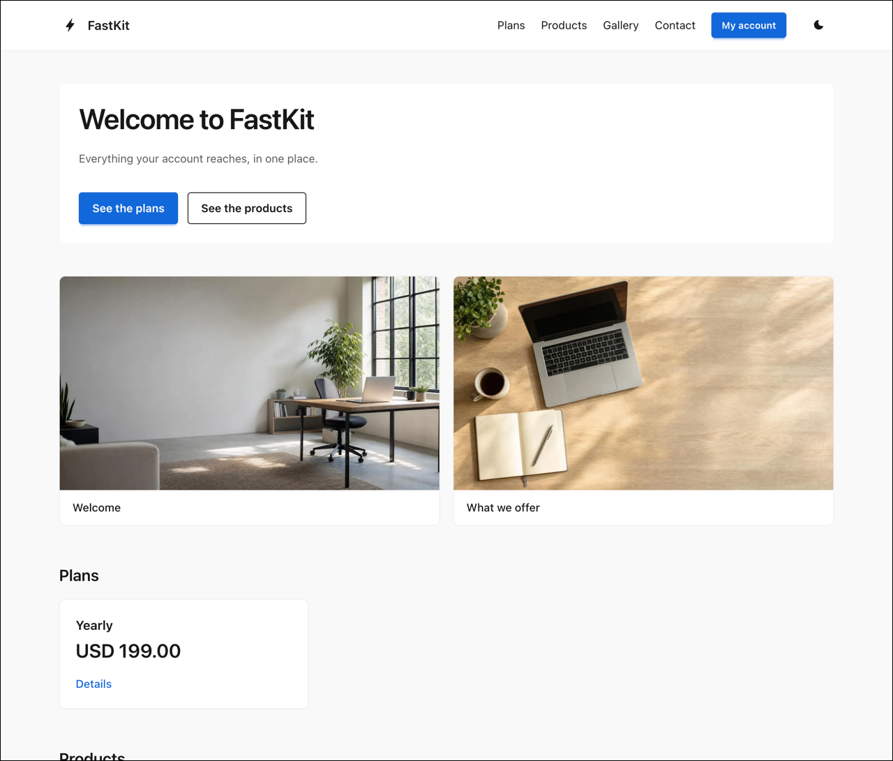
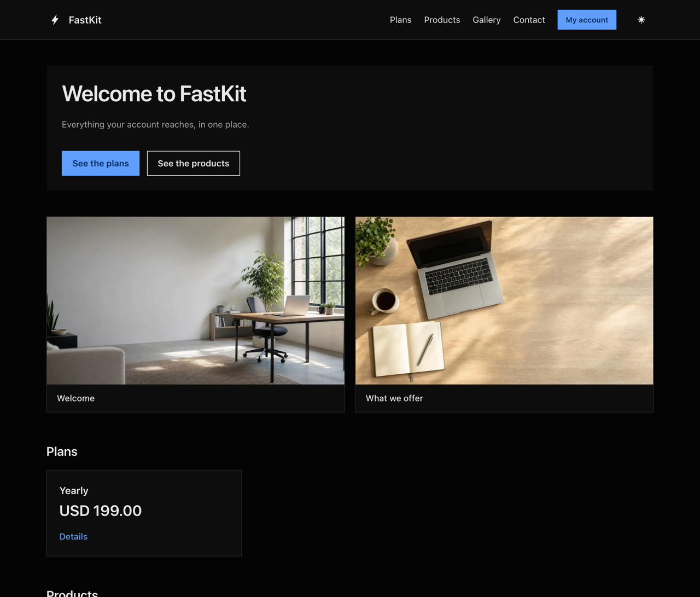
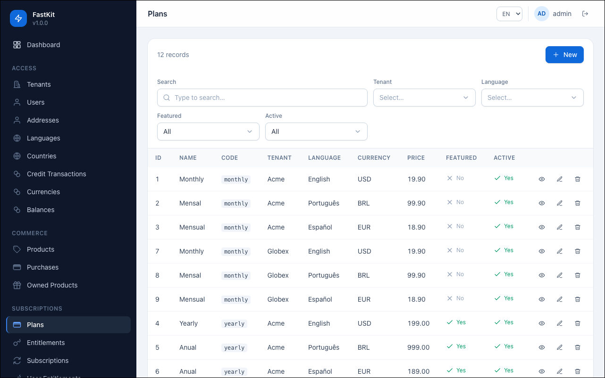

<p align="center">
    <a href="https://github.com/paulocoutinhox/fastkit" target="_blank" rel="noopener noreferrer">
        
    </a>
</p>

<p align="center">
  <a href="https://github.com/paulocoutinhox/fastkit/actions/workflows/test.yml"></a>
  <a href="https://github.com/paulocoutinhox/fastkit/blob/main/LICENSE.md"></a>
  <a href="https://www.python.org"></a>
  <a href="https://fastapi.tiangolo.com"></a>
</p>

<p align="center">
A multi-tenant public site, an admin panel and an API, built on FastAPI and served by one process.
</p>

<br>

## 🚀 Project

FastKit is a **website** and an **admin panel** written in FastAPI, with the API your applications talk
to alongside them. One process serves all three, each on its own path: the site at `/`, the panel at
`/admin`, and the API at `/api`.

The site is rendered on the server, so a crawler reads the same page a visitor does. The panel is not
written screen by screen — a resource is a declaration, and the grid, the filters, the forms and who
reaches them all come out of it.

Behind the three is the part every product rewrites anyway: accounts and sessions, tenants, roles, plans
and entitlements, a delivery engine that hands out what a subscription promised, payment gateways,
content, galleries, files and an audit trail.

That is why there is no separate worker, no broker, no scheduler process and no cache server. The queue
and the cache are tables in the same database, so scaling is one more copy of the same image.

## ✨ Features

- [x] Multi-tenant: a row belongs to one tenant or to every one of them, and an identity is unique inside a tenant and not across them
- [x] Sign in by email, username, document or phone, in one field
- [x] A session that ends when the password changes, and the right to be forgotten
- [x] Plans, entitlements, benefits, and a delivery engine that never pays a cycle twice
- [x] Products bought once and owned for good, with a balance per currency the product decides on
- [x] RevenueCat and Stripe behind one contract, where a new gateway is a class nothing else has to know about
- [x] Contents, banners and image galleries, each answering in the language the visitor is reading in
- [x] A plan written once per market, priced in the currency of the language it is read in
- [x] Server-rendered site: one URL per page, canonical links, sitemap and robots, in English, Portuguese and Spanish
- [x] Cookie consent where refusing is one click exactly like allowing, and withdrawing is as easy as giving
- [x] An image captcha or reCAPTCHA v3, chosen by the environment and never assumed
- [x] Uploads with a rule per purpose: the folder, the size, the name and what the image becomes
- [x] Filesystem or S3-compatible storage, and an orphan sweep that reads the files it wrote down
- [x] [Queuefy](https://github.com/paulocoutinhox/queuefy) in the same database, so ten copies still run a job once
- [x] [Cachefy](https://github.com/paulocoutinhox/cachefy) in the same database, holding the assembled answer a page or an endpoint serves
- [x] SQLite, MySQL and PostgreSQL, on the same code and the same queries
- [x] A ceiling on every body read into memory and on every listing a client reads
- [x] A liveness probe and a readiness probe that answer different questions
- [x] Wrong passwords counted on the account, with a wait that grows and is never shown to whoever is guessing
- [x] An audit row for everything the panel writes, and a request id tying it to the log
- [x] Roles declared in one line on a service, with a panel that draws only what the account reaches
- [x] Encryption keys that can be replaced, with a command that rewrites what is stored
- [x] `Idempotency-Key` on checkout, so a retried payment is one payment
- [x] An address a mail server refused for good stops receiving
- [x] 100% backend coverage, and a guard for every rule that would otherwise rot in silence

## 📦 Install

```bash
git clone https://github.com/paulocoutinhox/fastkit.git
cd fastkit
make deps
make site-deps
make admin-deps
```

## 🧭 The three surfaces

| Surface | Where it answers | What it renders | Session |
| --- | --- | --- | --- |
| Site | `/` | HTML from the server, so a crawler reads what a visitor does | a signed cookie, set on sign in |
| Admin | `/admin` | a Vue app driven by resource definitions, not written screen by screen | a bearer token the browser keeps |
| API | `/api` | JSON in camelCase | a bearer token that never expires on its own |

## 💡 How to use

Fill a local database with everything a developer machine needs, then serve it:

```bash
make seed
make site-build
make admin-build
make start
```

The site answers at `http://localhost:8000`, the admin at `http://localhost:8000/admin` with `admin` /
`admin`, and the API documents itself at `http://localhost:8000/docs`.

A resource is a model, a schema, a service and a definition. No screen is written by hand:

```python
class GalleryService(TaggedService):
    model = Gallery
    search_fields = ("tag",)
    text_search_fields = ("title",)
    filter_fields = ("tenant_id", "language_id", "active")
    ordering_fields = ("id", "title", "tag", "position", "published_at", "created_at")
    default_ordering = "position"
    relations = ("tenant", "language")
    label_fields = ("title",)
    position_field = "position"
    listing_fields = ("position", "id")
    dependents = (Dependent(GalleryPhoto, "gallery_id", ("image",)),)
```

That declaration is the listing, the filters, the search, the lookup, the ordering, the reordering
route and the admin grid, on both the API and the admin.

## 🧱 The words it uses

| Word | What it means |
| --- | --- |
| **Tenant** | one brand or one customer, and the scope a row belongs to |
| **Plan** | what a subscription is sold as, written once per market |
| **Entitlement** | what a plan grants, named by a code an application gates a feature with |
| **Benefit** | what an entitlement actually hands over: access, credits or a product |
| **Grant** | one delivery of one cycle, made idempotent by a key |
| **Product** | something bought once and owned for good |
| **Purchase** | one payment for one product, opened here and settled by the gateway |
| **Integration** | one payment gateway wired to one tenant |

## ⚙️ Commands

```bash
make test          # the backend suite, at 100% coverage
make admin-test    # the admin suite
make site-test     # the site assets suite
make format        # ruff and prettier
make migrate       # create the tables the code declares and leave the rest alone
make seed          # rebuild a local database and fill it
```

Run `make` with no target to see every one of them.

## 🐳 Docker

One image, one compose file, and `APP_ENV` picks the configuration:

```bash
make docker-build
make docker-start APP_ENV=prod
```

The container applies the schema before it serves, so a table the image expects is never missing on
the first read.

> **Fill in the secrets of `config/prod.py` before the first start.** The process refuses to serve
> while `security.secret_key` or `security.encryption_keys` still carries the placeholder this
> repository publishes, and it names the one it found. [Deploy](docs/deploy.md) lists everything an
> environment fills in.

## 🔑 Configuration

Every value an environment is lives in its own Python file under `config/`, and `APP_ENV` picks which
one loads. Nothing in `config/` reads an environment variable, because a variable lives on a machine
and is lost with it, while the file says what the environment *is*.

> **The files published here declare the shape of an environment and never the secret.** Every key in
> `config/stage.py` and `config/prod.py` is a placeholder, and whoever deploys fills in their own. Two
> guards fail the suite if a real credential, or anything shaped like one, ever lands in a published
> file.

## 📸 Screenshots

<p align="center">
    
</p>

<p align="center">
    
</p>

The palette is written by the server, so a page never draws light and then turns while somebody is
reading it. Both sides come from one declaration, and a test measures the contrast of every pair a
page puts one on top of the other.

<p align="center">
    
</p>

That grid is not a screen anybody wrote. The columns, the search box, the filters, the ordering and
the pagination all come from one resource definition, and adding a resource adds a definition and
nothing else.

## 📚 Documentation

- [Architecture](docs/architecture.md) — the layers, and what each one is not allowed to do
- [Configuration](docs/configuration.md) — environments, tenants and what each section of the settings holds
- [Accounts](docs/accounts.md) — identities, roles, sessions and the right to be forgotten
- [Site](docs/site.md) — the public pages, the session, cookies, CSRF and SEO
- [Admin](docs/admin.md) — resources, fields and the screens they drive
- [Subscriptions](docs/subscriptions.md) — plans, entitlements, benefits and the delivery engine
- [Commerce](docs/commerce.md) — products, purchases and balances
- [Gateways](docs/gateways.md) — RevenueCat, Stripe and how to add another
- [Captcha](docs/captcha.md) — the providers and where they are asked
- [Jobs](docs/jobs.md) — the scheduler and what runs on it
- [Deploy](docs/deploy.md) — Docker, schema changes and what goes in which order

## ☕ Buy me a coffee

Support the continuous development of this project.

<a href='https://ko-fi.com/A0A412XEV' target='_blank'></a>

## 🖼️ Pictures

The `make seed` recipe fills a local database with the pictures in `extras/seed/`, each drawn for the very thing it
illustrates, so the office gallery shows an office and a product shows a product. They live here on
purpose: seeding needs no network and draws the same thing every time.

Each one is stored through the very pipeline an operator's upload walks, at the exact resolution its
upload purpose declares — a banner at 1920×1080 cropped, an avatar at 256×256 cropped, a gallery photo
at 1600×900 cropped — so a seeded file is a real one. Change `settings.uploads` and the next seed
follows it. See [Configuration](docs/configuration.md#uploads).

## 📄 License

[MIT](https://opensource.org/licenses/MIT)

Copyright (c) 2026, Paulo Coutinho

---

Made with ❤️ by [Paulo Coutinho](https://github.com/paulocoutinhox)
